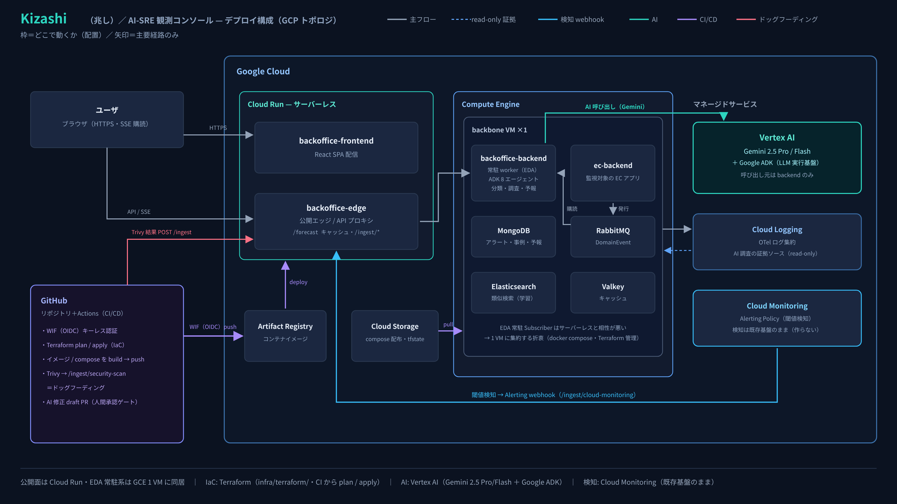
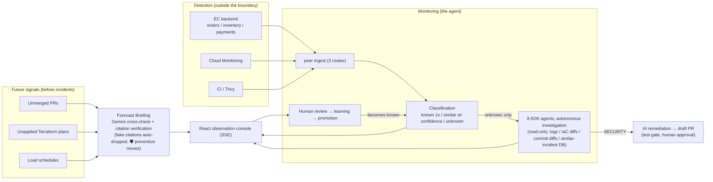

# Kizashi (兆し — "early sign") — AI-SRE Agent (repository: ec-monitoring-agent)

> **End incidents before they begin.**

**Before an incident**, Kizashi forecasts risks with verified citations and proposes preventive moves. **After an incident fires**, an AI agent takes over the manual "investigate → assess → review" workflow that follows every alert. It **learns from human approvals**, so the same failure is classified in under a second — at zero AI cost — the next time. An AI-SRE agent that sits **on top of** your existing monitoring stack instead of replacing it.

Built for the Findy **DevOps × AI Agent Hackathon 2026**.

> 🇯🇵 日本語版（正）: [README.md](README.md) — the Japanese README and [docs/](docs/) are the source of truth; this file is a translated summary.

| Measured (demo environment)  |                                                                                                              |
| ---------------------------- | ------------------------------------------------------------------------------------------------------------ |
| Forecast                     | Cross-checks 3 kinds of future signals × past incident memory — **only citation-verified evidence is shown** |
| AI investigation (unknown)   | **8 ADK agents** traverse evidence read-only; report with evidence links in ~2–3 minutes                     |
| Known-failure classification | **Under 1 second, zero AI cost** (deterministic)                                                             |
| Tests                        | **1,156 unit tests** + 22 E2E tests (learning loop & citation verification covered deterministically)        |

## What makes it different

- **It forecasts risks with evidence, before anything breaks (Forecast Briefing — implemented).** Gemini cross-checks "future signals" (unmerged PRs, unapplied Terraform plans, load schedules) against memories of past incidents and produces forecasts like "Sat 20:00 — DB connection exhaustion, HIGH." Citations are machine-verified against real signals; **fake citations are dropped before display**. Each risk carries a one-line "🛡 preventive move you can make now" (executed by humans; the system stays write-zero).
- **Detection stays with your existing stack** (Cloud Monitoring etc. remain the authority). Once an alert fires, **8 ADK agents** (hub-and-spoke) autonomously traverse Cloud Logging, applied Terraform diffs, real GitHub commit diffs, and past similar incidents — **strictly read-only** — and produce a root-cause estimate with evidence links. Because it doesn't replace your monitoring SaaS, adoption is additive.
- **Known = 1 second; AI only for the unknown.** A confidence spectrum — exact match (deterministic) → similar ("quasi-known" with confidence) → unknown (AI investigation) — keeps the expensive investigation path reserved for genuinely new failures.
- **Anti-hallucination: correlations must be backed by evidence.** The AI may link two alerts causally only when they share concrete evidence (same commit / Terraform diff / metric spike, with citations). Correlation citations are machine-resolved against collected evidence ids, and a dedicated critic agent (CorrelationVerifier) validates causal direction before anything is finalized — avoiding both "missing a real link" and "fabricating a plausible one."
- **Learning loop.** Human approvals feed the similar-incident corpus; recurring patterns get promoted to known patterns → next occurrence classifies in 1 second with no AI call.
- **Structural read/write separation.** Investigation is read-only; remediation is write-isolated: for vulnerabilities, an AI fixes real code on GitHub Actions, passes a Trivy re-scan and green tests, and opens a **draft PR** (no auto-merge; human approval gate).
- **Dogfooding (self-operating loop).** This repository's own CI (Trivy) feeds its findings into the production `/ingest/security-scan` endpoint; a SECURITY investigation can trigger AI remediation that opens a draft PR against this very repository — **the monitored EC app and the monitoring agent itself live inside the same DevOps loop** (see [architecture.md §6.5](docs/architecture.md) — Japanese).
- **Honest synthesis + real evidence.** Synthetic demo inputs are explicitly badged (amber) in the UI; only the entry point is synthetic — transform → classify → AI investigation run the real pipeline. No fake buttons without endpoints. External links attached to evidence are **real and deterministically derived**: CVE → real NVD pages (only canonical CVE ids resolve — no 404s), Terraform evidence → the actual change PR.

## System Configuration Diagram



## Architecture



## Architecture summary

Full details (in Japanese, code-accurate): **[docs/architecture.md](docs/architecture.md)**. The diagrams there are Mermaid and readable without Japanese. Key points:

- **Detection is outside the boundary.** Cloud Monitoring, the EC app's domain events, and CI security scans are the detection authorities. Three peer-ingest routes (RabbitMQ subscription, `/ingest/cloud-monitoring` webhook, `/ingest/security-scan`) merge into one pipeline. Duplicate storms collapse via `dedupKey` + occurrence count.
- **Classify → investigate → learn.** Exact known-pattern match resolves in ~1s with no AI. Unknown alerts trigger an asynchronous investigation: 8 in-process ADK agents (coordinator, evidence collector, root-cause analyst, impact triage, correlation verifier/critic, remediation planner, runbook escalation, remediation reviewer) with read-only tools. Results stream to the UI over SSE, including live `investigation-progress` events. Human approval indexes the case into the similar-incident corpus; promotion crystallizes it into a known pattern.
- **Forecast Briefing.** Future signals (unmerged PRs / unapplied Terraform plans / load schedules) × memories of resolved alerts → Gemini produces cited risk forecasts. Citations that don't resolve to real signal ids are dropped; risks with zero backing are discarded entirely. `GET /forecast` serves a pre-generated cache (zero AI cost for unattended viewing).
- **Prompt-injection threat model (deliberate design decision).** No dedicated input-boundary guardrail (Model Armor / Bedrock Guardrails equivalent) yet; instead the blast radius is bounded architecturally: read-only investigation tools, write-isolated remediation behind a human-approved draft PR, secrets delivered via Secret Manager (never in LLM context), least-privilege service separation, JSON-schema-constrained outputs with citation verification. The limitation is stated honestly and an input-layer guard is recorded as a future extension (architecture.md §5.5).
- **Deployment.** Cloud Run (frontend / public edge) + Compute Engine (EDA-resident backends, RabbitMQ, MongoDB, Elasticsearch, Valkey) + Vertex AI (Gemini 2.5 Pro/Flash). IaC is Terraform, applied from CI via Workload Identity Federation with an approval gate.
- **Code layout.** DDD + Clean Architecture + CQRS + EDA. Ports are swappable by DI (single-Gemini adapter ⇄ ADK multi-agent adapter; deterministic stub for tests).

## Tech stack

|          |                                                                                                                                 |
| -------- | ------------------------------------------------------------------------------------------------------------------------------- |
| AI       | **Gemini 2.5 Pro/Flash** (Vertex AI, ADC) + **Google ADK** (in-process multi-agent). Port DI swaps single Gemini ⇄ ADK          |
| Backend  | TypeScript / Express, **DDD + Clean Architecture + CQRS + EDA**, RabbitMQ, MongoDB, Elasticsearch, Valkey                       |
| Frontend | React, SSE                                                                                                                      |
| Infra    | **Cloud Run** (frontend / edge) + **Compute Engine** (EDA residents), Terraform, Cloud Monitoring / Cloud Logging (direct OTel) |
| CI/CD    | GitHub Actions                                                                                                                  |

### Cross-cutting infrastructure (deliberately kept off the flow diagrams)

The architecture diagrams show **data causality**; concerns that apply uniformly to every node are listed here instead of cluttering the graph. All are Terraform-managed and are the concrete backing for the §5.5 threat model's defense-in-depth.

|                    |                                                                                                          |
| ------------------ | -------------------------------------------------------------------------------------------------------- |
| Secrets            | **Secret Manager** (tf manages the secret shells only; plaintext versions injected out-of-band → never in tfstate, never in LLM context) |
| CI auth            | **Workload Identity Federation** (keyless — no SA keys distributed to GitHub Actions)                     |
| Least privilege    | **12 service accounts**, per-subservice isolation → bounded lateral movement                              |
| State / artifacts  | **GCS ×2** (tfstate + deploy artifacts) with state-lock serialization; **Artifact Registry ×2**          |
| Networking         | VPC / subnet / **VPC Access Connector ×3** / static IP / firewall (Cloud Run → GCE-resident RabbitMQ/Mongo/ES/Valkey) |
| Write safety       | **Draft-PR human-approval gate** for AI remediation (no auto-merge)                                        |

## Quick start (local)

```bash
pnpm install
make up          # infra (Mongo/RabbitMQ/ES/Valkey) + EC + backoffice + frontend
make seed        # seed known patterns & similar incidents
make test        # unit tests
make e2e         # E2E
```

Failure scenarios can be injected from the **DEMO CONSOLE** in the backoffice UI ([scenario list](docs/architecture.md) §9 — Japanese). Running AI investigation requires Gemini credentials (`GOOGLE_GENAI_USE_VERTEXAI=true` + ADC, or `GEMINI_API_KEY`). A deterministic stub is available with `AI_INVESTIGATION_STUB=true`. See [.env.example](.env.example) for environment variables.

## Demo scenarios (5)

Payment timeout (known, 1s) / DB pool exhaustion (similar, confidence) / infrastructure failure (real Cloud Monitoring route — the ~1 min detection latency is visualized with a "detection pending" banner — plus a synthetic repeatable variant 3b; evidence includes the Terraform diff and the change PR link) / vulnerability detection → AI-remediated draft PR (CVEs link to real NVD pages). The set covers **the full confidence spectrum (known → similar → unknown) and three grades of input realism (real trigger / real cloud detection / synthetic), one scenario each, with nothing redundant**.

The **forecast demo console** on `/forecast` additionally offers the flagship DB-connection-exhaustion seed (unapplied plan × load schedule × past resolved incidents) to experience "forecast → citation chips → real PR."

## Documentation

All detailed documentation is in Japanese (source of truth):

|                                              |                                                                                                                                                                                   |
| -------------------------------------------- | --------------------------------------------------------------------------------------------------------------------------------------------------------------------------------- |
| [docs/architecture.md](docs/architecture.md) | **Architecture (code-accurate, current truth)**: overview, classification/investigation/learning flows, ADK agent graph, deployment, API, scenarios — Mermaid diagrams throughout |
| [docs/steps/](docs/steps/README.md)          | Design documents (step series — history and rationale)                                                                                                                            |
| [docs/decisions/](docs/decisions/)           | Decision records                                                                                                                                                                  |
