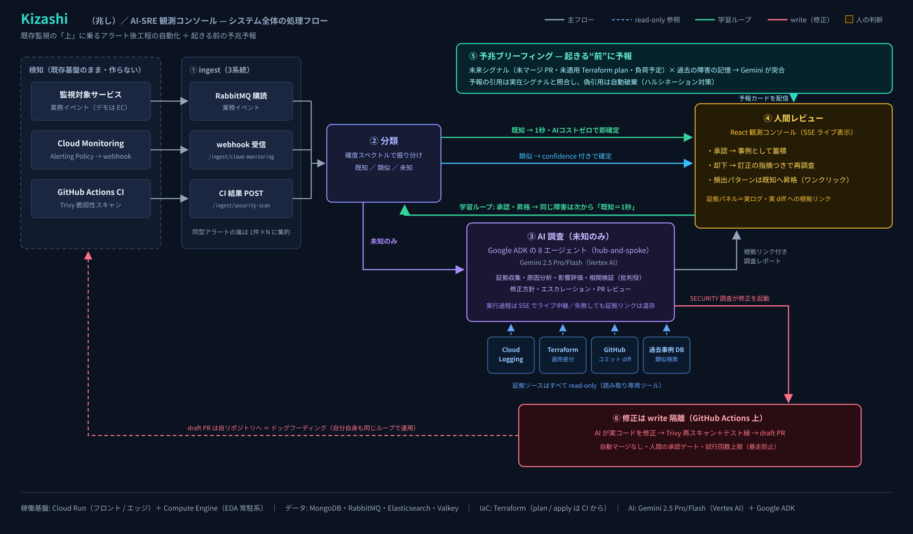
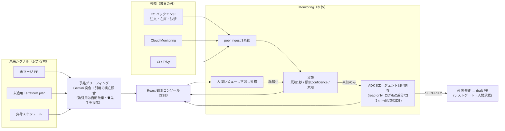

# Kizashi（兆し） — AI-SRE エージェント（リポジトリ名: ec-monitoring-agent）

> **障害は、起きる前に終わらせる。**
>
> 🇬🇧 English summary: [README.en.md](README.en.md)

**起きる前**はリスクを引用付きで予報して先手を提示し、**起きた後**はアラート発火後の「調査 → 評価 → レビュー」の人手ワークフローを AI エージェントが肩代わりする。**人の承認で学習**し、同じ障害は次から 1 秒・AI コストゼロで判定——既存の監視基盤の上に乗る AI-SRE エージェント。

Findy **DevOps × AI Agent Hackathon 2026** 出展作品。

| 実測（デモ環境）   |                                                                          |
| ------------------ | ------------------------------------------------------------------------ |
| 予報               | 未来シグナル3系統×過去の記憶を突合・**引用は実在照合済みのみ表示**       |
| 未知障害の AI 調査 | **ADK 8エージェント**が read-only 横断・約2〜3分で根拠リンク付きレポート |
| 既知障害の判定     | **1秒未満・AI コストゼロ**（決定論）                                     |
| テスト             | ユニット **1103件** ＋ E2E 22件（学習ループ・引用検証を決定論担保）      |

## 何が違うか

- **起きる前に、根拠付きで予報する（予兆ブリーフィング・実装済み）**。未マージ PR・未適用 Terraform plan・負荷スケジュールという「未来シグナル」と過去の障害の記憶を Gemini が突合し、「土 20:00、DB 接続枯渇 HIGH」のように予報。引用は実在シグナルと機械照合し**偽の引用は表示前に自動破棄**。各リスクには「🛡 今打てる先手」を1行提示（実行主体は人間・write ゼロ）。
- **検知は既存基盤に任せ、その上に乗る**（Cloud Monitoring 等の上流が検知の権威）。発火済みアラートを受け、**ADK 8エージェント**（hub-and-spoke）が Cloud Logging・Terraform 適用差分・GitHub 実コミット diff・過去類似インシデントを **read-only で自律横断**し、根拠リンク付きで原因を推定する。監視 SaaS を置き換えないため、いまの運用に足すだけで導入できる。
- **既知は1秒・未知だけ AI**。完全一致（決定論）→ 類似（confidence 付き「準・既知」）→ 未知（AI 調査）の確度スペクトルで分類し、コストの重い調査は未知のみ起動。
- **ハルシネーション対策＝相関は証拠で裏づける**。AI が別アラートとの因果を張るときは、共有する具体的証拠（同一の commit/terraform 差分・メトリクス急増・引用）がある場合のみ関連づけ、時間が近いだけの"それっぽい因果"は張らせない。他責（外部起因・例: 決済タイムアウト）を同時発生の別障害で内部原因へ言い換えない＝「関連を見失う」と「でっち上げる」を**両方**避ける（引用の実在照合で偽を落とす思想を、予兆の引用にも調査の相関にも一貫適用）。機構は二段: 相関の citation を収集済み証拠 id へ**機械照合**して解決しない関連を破棄＋確定前に**批判役エージェント（CorrelationVerifier）**が因果の向きの妥当性を検証（修正PRを批判役がレビューするのと同じ「生産者→批判役」構造）。
- **学習ループ**。人間の正解フィードバックが類似分類の母集団になり、頻出は既知パターンへ昇格 → 次回は1秒で分類（AI 呼び出し不要）。
- **調査=read / 修正=write の構造分離**。脆弱性は GitHub Actions 上で AI が実コードを修正し、Trivy 再スキャン＋テスト緑を通って **draft PR**（自動マージなし・人間承認ゲート）。
- **ドッグフーディング（自己運用ループ）**: このリポジトリ自身の CI（Trivy）の検出が本番の `/ingest/security-scan` に流れ、SECURITY 調査が AI 実修正 → 自リポジトリへの draft PR を起こす＝**監視対象の EC も、監視するエージェント自身も、同じ DevOps ループの中にいる**（`.github/workflows/` の実ワークフローが運用系そのもの。図解 → [architecture.md §6.5](docs/architecture.md#65-devops-ドッグフーディング自己運用ループ)）。
- **正直な合成 ＋ 証拠は本物**: デモの合成入力は UI 上で amber バッジ明示（入口のみ合成・変換→分類→AI 調査は実経路）。エンドポイントの無い偽ボタンは作らない（修正の起票も既定 `REMEDIATION_MODE=demo` では、同じ AI 修正パイプラインが事前起票した**実 draft PR** を提示＝リンク先は本物・何度押しても PR は増やさない。その場でのライブ起票は `REMEDIATION_MODE=dispatch/advisory` で有効）。さらに証拠に添える**外部リンクは実在・決定論導出**——脆弱性は CVE→NVD 実在リンク（正規形の CVE のみ解決＝404 を作らない）、terraform 証拠→変更 PR。config 未設定（本番）は素の証拠のまま＝挙動非侵食。

## 全体像



<details>
<summary>テキスト版（Mermaid）</summary>



</details>

詳細図（調査フロー・エージェントグラフ・デプロイ構成）は **[docs/architecture.md](docs/architecture.md)** へ。

## 技術スタック

|                |                                                                                                                                        |
| -------------- | -------------------------------------------------------------------------------------------------------------------------------------- |
| AI             | **Gemini 2.5 Pro/Flash**（Vertex AI・ADC）＋ **Google ADK**（in-process マルチエージェント）。ポート DI で単一 Gemini ⇄ ADK を差し替え |
| バックエンド   | TypeScript / Express・**DDD + Clean Architecture + CQRS + EDA**・RabbitMQ・MongoDB・Elasticsearch・Valkey                              |
| フロントエンド | React・SSE                                                                                                                             |
| インフラ       | **Cloud Run**（frontend / edge）＋ **Compute Engine**（EDA 常駐系）・Terraform・Cloud Monitoring / Cloud Logging（OTel 直送）          |
| CI/CD          | GitHub Actions                                                                                                                         |

## クイックスタート（ローカル）

```bash
pnpm install
make up          # infra(Mongo/RabbitMQ/ES/Valkey) + EC + backoffice + frontend
make seed        # 既知パターン・類似インシデントの seed
make test        # ユニットテスト
make e2e         # E2E
```

バックオフィス UI の **DEMO CONSOLE** から障害シナリオを注入できる（[シナリオ一覧](docs/architecture.md#9-デモシナリオ5ボタンリアルさバッジ付き)）。AI 調査を動かすには Gemini 認証（`GOOGLE_GENAI_USE_VERTEXAI=true`＋ADC、または `GEMINI_API_KEY`）が必要。決定的スタブは `AI_INVESTIGATION_STUB=true`。環境変数は [.env.example](.env.example) を参照。

## デモシナリオ（5本）

決済タイムアウト（既知・1秒）／DB プール枯渇（類似・confidence）／インフラ障害（実 Cloud Monitoring 経路＝着弾約1分を「検知待ち」バナーで可視化＋合成反復用 3b・証拠に terraform 差分と変更 PR リンク）／脆弱性検知→AI 実修正 draft PR（CVE は NVD 実在リンク）。**確度スペクトル（既知→類似→未知）と入力のリアルさ3階級（実トリガ/クラウド実検知/合成）を過不足なく1本ずつ**に絞った構成。各シナリオの一覧は [docs/architecture.md §9](docs/architecture.md) を参照。

加えて `/forecast`（予兆ブリーフィング）の**予兆デモコンソール**から、DB 接続枯渇予報のフラッグシップ seed（未適用 plan×負荷スケジュール×過去の解決事例）で「予報→引用チップ→実 PR」を体験できる。

## ドキュメント

|                                                                                        |                                                                                                               |
| -------------------------------------------------------------------------------------- | ------------------------------------------------------------------------------------------------------------- |
| [docs/architecture.md](docs/architecture.md)                                           | **アーキテクチャ（コード準拠・現状の正）**。全体図・分類/調査/学習フロー・ADK グラフ・デプロイ・API・シナリオ |
| [docs/steps/](docs/steps/README.md)                                                    | 設計書（step 系・経緯と理由）。索引に実装とのドリフト注記あり                                                 |
| [docs/decisions/](docs/decisions/)                                                     | 決定記録・[ADR 集](docs/decisions/ADR.md)（検知境界・a2a 不使用・学習ループ等の意思決定要約）                 |

## ステータス（2026-07-07）

- 実装済み: **予兆ブリーフィング**（未来シグナル×記憶→引用検証付きリスク予報・`/forecast` ページ・「🛡 今打てる先手」・予兆デモコンソール。詳細 → [architecture.md §10](docs/architecture.md)）／検知境界＋3系統 ingest／分類3層（既知・類似・未知）／ADK 8エージェント調査（**実行イベントの SSE ライブ中継＝調査タイムライン可視化**・相関の citation 実在照合＋批判役 CorrelationVerifier）／学習ループ・昇格／リメディエーション（advisory・dispatch）／証拠の実リンク化（CVE→NVD・terraform→変更 PR・config 駆動で非侵食）／実検知シナリオの「検知待ち」バナー／SSE UI／Cloud Run + GCE デプロイ／CI/CD 一式
- 設計のみ（ハッカソン後）: イベントソーシング基盤（[step4-1 §7.10](docs/steps/step4-1-strategy.md)）
