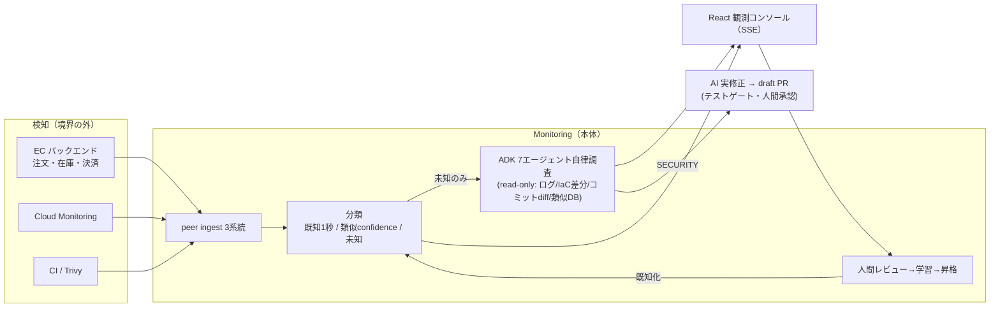

# EC Monitoring Agent — AI-SRE 調査エージェント

**既存の観測基盤の「検知」の上に乗り、アラート発火後の「調査 → 評価 → レビュー」の人手ワークフローを AI エージェントが圧縮する。** さらに（開発中）「起きる前」に引用付きでリスクを予報する。

Findy **DevOps × AI Agent Hackathon 2026** 出展作品。

## 何が違うか

- **検知はしない**（Cloud Monitoring 等の上流の責務）。発火済みアラートを受け、**ADK 7エージェント**（hub-and-spoke）が Cloud Logging・Terraform 適用差分・GitHub 実コミット diff・過去類似インシデントを **read-only で自律横断**し、根拠リンク付きで原因を推定する。
- **既知は1秒・未知だけ AI**。完全一致（決定論）→ 類似（confidence 付き「準・既知」）→ 未知（AI 調査）の確度スペクトルで分類し、コストの重い調査は未知のみ起動。
- **学習ループ**。人間の正解フィードバックが類似分類の母集団になり、頻出は既知パターンへ昇格 → 次回は1秒で分類（AI 呼び出し不要）。
- **調査=read / 修正=write の構造分離**。脆弱性は GitHub Actions 上で AI が実コードを修正し、Trivy 再スキャン＋テスト緑を通って **draft PR**（自動マージなし・人間承認ゲート）。
- **ドッグフーディング**: このリポジトリ自身の CI（Trivy）の検出が本番の `/ingest/security-scan` に流れる＝監視エージェント自身が同じ DevOps ループの中にいる。
- **正直な合成**: デモの合成入力は UI 上で amber バッジ明示（入口のみ合成・変換→分類→AI 調査は実経路）。エンドポイントの無い偽ボタンは作らない。

## 全体像



詳細図（調査フロー・エージェントグラフ・デプロイ構成）は **[docs/architecture.md](docs/architecture.md)** へ。

## 技術スタック

| | |
| --- | --- |
| AI | **Gemini 2.5 Pro**（Vertex AI・ADC）＋ **Google ADK**（in-process マルチエージェント）。ポート DI で単一 Gemini ⇄ ADK を差し替え |
| バックエンド | TypeScript / Express・**DDD + Clean Architecture + CQRS + EDA**（CodelyTV パターン準拠）・RabbitMQ・MongoDB・Elasticsearch・Valkey |
| フロントエンド | React（ダーク観測コンソール・SSE ライブ・**AI調査ライブタイムライン**・証拠パネル・承認 UI・着弾/更新/dedup のライブ演出） |
| インフラ | **Cloud Run**（frontend / edge）＋ **Compute Engine**（EDA 常駐系）・Terraform・Cloud Monitoring / Cloud Logging（OTel 直送） |
| CI/CD | GitHub Actions（typecheck/UT/E2E → build → deploy／Trivy → 実 ingest／AI リメディ workflow／terraform plan・apply） |
| テスト | Vitest（BDD）**846件・125ファイル**＋ Playwright E2E |

## クイックスタート（ローカル）

```bash
pnpm install
make up          # infra(Mongo/RabbitMQ/ES/Valkey) + EC + backoffice + frontend
make seed        # 既知パターン・類似インシデントの seed
make test        # ユニットテスト
make e2e         # E2E
```

バックオフィス UI の **DEMO CONSOLE** から障害シナリオを注入できる（[シナリオ一覧](docs/architecture.md#9-デモシナリオ8ボタンリアルさバッジ付き)）。AI 調査を動かすには Gemini 認証（`GOOGLE_GENAI_USE_VERTEXAI=true`＋ADC、または `GEMINI_API_KEY`）が必要。決定的スタブは `AI_INVESTIGATION_STUB=true`。環境変数は [.env.example](.env.example) を参照。

## デモシナリオ（8本）

決済タイムアウト（既知・1秒）／DB プール枯渇（類似・confidence）／在庫競合（未知→AI 調査）／インフラ障害（実 Cloud Monitoring 経路＋合成反復用）／脆弱性検知→AI 実修正 draft PR／terraform apply 起因の構成変更障害／アプリコード退行（**実コミットの実 diff を AI が読んで原因特定**）。各シナリオの分類スペクトルと入力のリアルさは [docs/architecture.md §9](docs/architecture.md) に一覧。

## ドキュメント

| | |
| --- | --- |
| [docs/architecture.md](docs/architecture.md) | **アーキテクチャ（コード準拠・現状の正）**。全体図・分類/調査/学習フロー・ADK グラフ・デプロイ・API・シナリオ |
| [docs/steps/](docs/steps/README.md) | 設計書（step 系・経緯と理由）。索引に実装とのドリフト注記あり |
| [docs/decisions/](docs/decisions/) | 決定記録（例: シナリオ6/7 の自動修正見送り） |
| [docs/steps/step6-final-sprint-strategy.md](docs/steps/step6-final-sprint-strategy.md) | 現役スプリント戦略（予兆ブリーフィング×デモ防御） |

## ステータス（2026-07-03）

- 実装済み: 検知境界＋3系統 ingest／分類3層（既知・類似・未知）／ADK 7エージェント調査（**実行イベントの SSE ライブ中継＝調査タイムライン可視化**）／学習ループ・昇格／リメディエーション（advisory・dispatch）／SSE UI／Cloud Run + GCE デプロイ／CI/CD 一式
- 開発中: **予兆ブリーフィング**（未来シグナル×記憶→引用検証付きリスク予報。backend F1〜F6＋UI F7（`/forecast` ページ・引用チップ＝実在シグナルへのリンクのみ表示）＋F8 フラッグシップ seed（DB接続枯渇: pending plan／schedule／過去解決事例。ローカルE2E は stub の偽引用混入で引用検証を決定論実演）まで着地・残りは実PRステージング/録画。[todo](docs/steps/step6-final-sprint-todo.md)）
- 設計のみ（ハッカソン後）: イベントソーシング基盤（[step4-1 §7.10](docs/steps/step4-1-strategy.md)）
