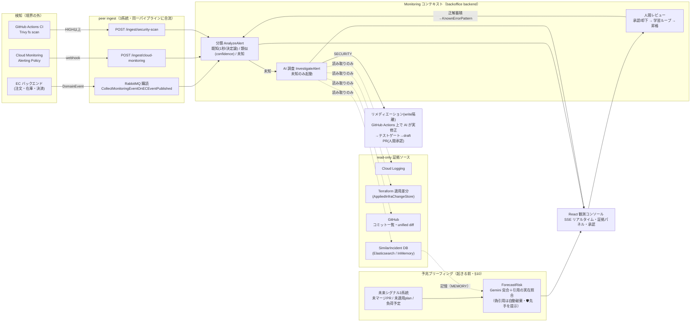
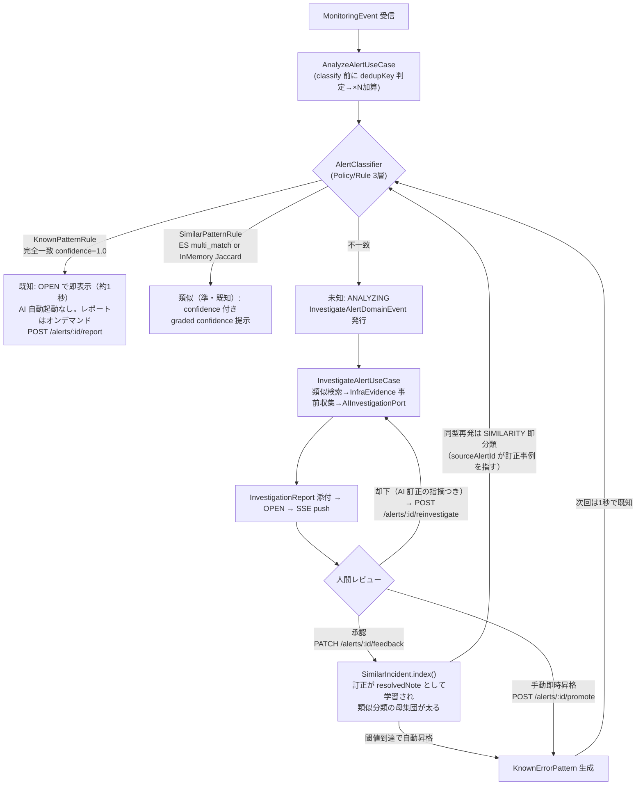
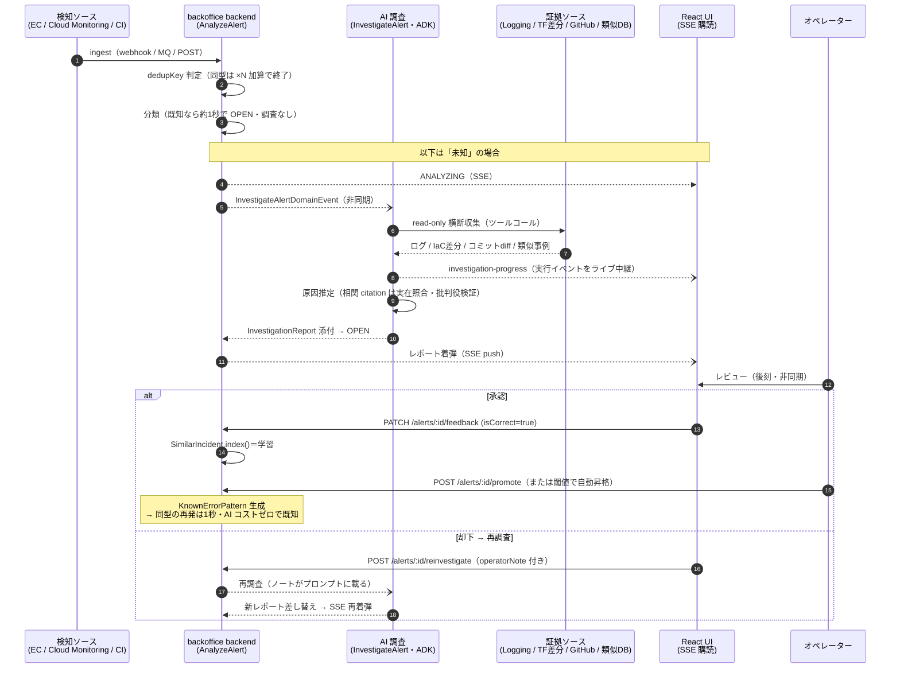
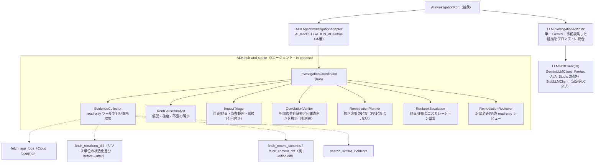
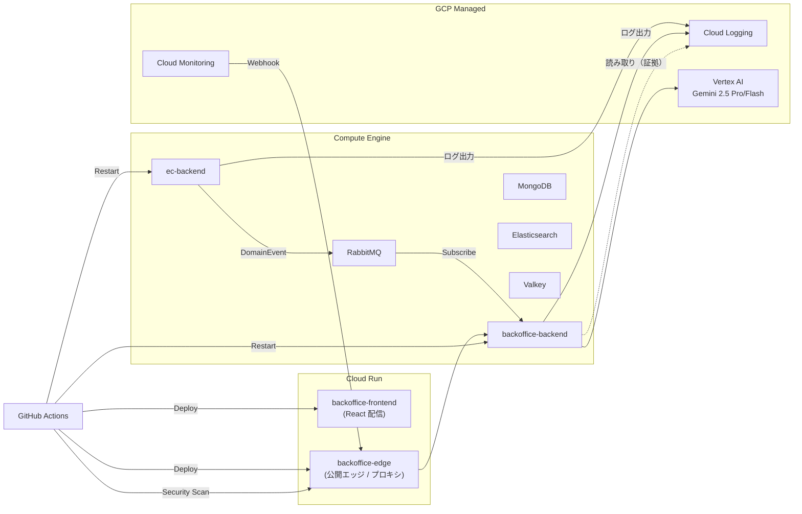
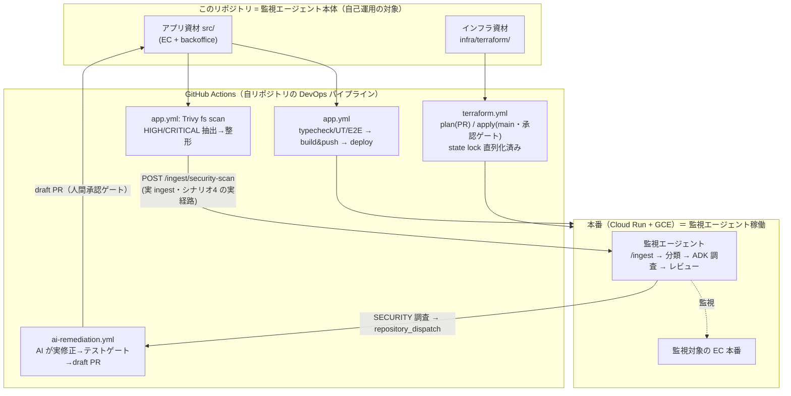

# Kizashi（兆し）アーキテクチャ（コード準拠・2026-07-11 時点）

> **本書はコードを正とした現状スナップショット**。設計の経緯・理由は [docs/steps/](steps/)（step 系設計書）と [docs/decisions/](decisions/) を参照。ここに書かれていることはすべて実装済み（未実装は明示）。

## 1. 一言

**起きる前**は未来シグナル（未マージ PR・未適用 Terraform plan・負荷予定）を過去の記憶と突合して引用検証付きのリスク予報を出し（§10・**記憶は確度を上げる材料で、無くても未来シグナル単独で予報は出る**）、**起きた後**は既存の観測基盤（Cloud Monitoring 等）の「検知」の上に乗って、アラート発火後の「**調査 → 評価 → レビュー**」の人手ワークフローを AI エージェントが圧縮するシステム。検知（閾値発火・dedup・相関）は上流の責務＝境界の外に置き、本体は「発火済みアラート」を受けて自律調査する。

## 2. システム全体図



- **検知の被り対策3層**: (a) category オーナーシップ（APPLICATION=ECイベント / INFRASTRUCTURE・CAPACITY=Cloud Monitoring が権威） (b) `dedupKey`（`source::category::eventName`＋任意 discriminator）＋ `occurrenceCount` で同型アラート嵐を1件×Nに畳む (c) 異症状・同一根本原因の相関は AI 調査に委譲（エンジン化しない）。相関（`relatedAlerts`）には**共有証拠の citation を必須化**し、収集済み証拠 id（commit sha / terraform アドレス / メトリクス名＝`collectCitableEvidenceIds`）に解決しない関連はマッパで破棄・確信度加点（`related_alert`）も citation 付きのみ＝時間が近いだけの捏造因果（例: 他責の決済タイムアウトを同時発生の在庫アラートで内部原因化）を構造的に落とす（予兆の引用検証と同型のガード）。ADK 経路ではさらに確定前に **CorrelationVerifier（批判役・推論のみ）** が「共有証拠を指せるか＋fault 分類に対し因果の向きが妥当か」を検証＝決定論の歯（citation 照合）と推論の歯（向きの検証）の二段。
- 1 ingest = 1 Alert。回復通知等は `severity=info` → `isAlertable()=false` で観測のみ。

## 3. 分類 → 調査 → 学習ループ



- 承認済みアラートは dedup 窓から除外（再発火が即・既知として新規表示＝既知事象の高速判定を体験可能）。承認済み一覧は Analytics ページで確認できる。
- 却下→再調査は「やり直し」＝過去のレビューをクリアして新レポートを白紙で承認/却下できる状態に戻す（`Alert.reopenForReinvestigation`・operatorNote が次の調査プロンプトに載る）。二値学習の feedback とは別概念。**クリアされるのは「最新の判定」という状態（`feedback`）だけで、判定の履歴（`Alert.reviewHistory`＝追記のみ）は残る**——正答率の母数はこの履歴から数えるため、却下 → 再調査 → 承認 は 1/2 として数えられる（[ADR-29](decisions/ADR.md#adr-29-判定は上書きの状態と追記の事実に分ける正答率の母数は履歴から数える)）。履歴は AI の採点（`isCorrect`）と人間の決裁（`decision`: acted / deferred / rejected）を別フィールドで持つ。
- このループは E2E で縦に担保: 未知→調査→承認（OPEN 据置）→手動昇格→再発が即・既知（AI 調査なし）→オンデマンドレポート→却下→再調査差し替え（`e2e/backoffice/feedback-lifecycle.e2e.test.ts`）、および「オペレーターの訂正が次回の SIMILARITY 分類の正になる」学習一周（同ファイル similarity learning loop）。
- **却下は分類を変えない（学習は承認のみ）**: `SubmitFeedbackUseCase` が SimilarIncident に index するのは `isCorrect=true`（承認）時だけ。却下（`isCorrect=false`）は、直前が承認だった場合にその学習を撤回する（`withdrawResolved`）のみで、新たな学習は積まない。却下時の operatorNote は当該 Alert に残るが将来の分類母集団には流れない＝二値学習シグナルを濁さない設計。オペレーターの「これは DB でなく X だった」を将来へ効かせる唯一の経路は **再調査（operatorNote で AI に該当 Alert の結論を訂正させる）→ その結果を承認（訂正が `resolvedNote` としてコーパスに入る）**。「却下理由そのものを負例／訂正シグナルとして学習に反映する」経路は現状なく、やるなら新規の設計判断。
- **同型 eventName の判別限界（正直さ）**: 3/3b のように eventName・payload が近い別障害は、決定論の `SimilarPatternRule`（Jaccard [0,1]）では判別力が弱く、実質の分岐は AI 調査の判断に委ねられる。メモに新障害を特徴づける語（エラーメッセージ／リソース名）を残すほど次回の SIMILARITY と AI プロンプトの弁別が効く。なお InMemory コーパスは起動時 warmUp＝揮発（`/demo/reset` で全 DB 話の seed に戻る）で、訂正の永続は Elasticsearch 構成時のみ。

### 3.1 時間軸ビュー（未知アラート1件の一生・シーケンス）

上のフロー図では見えない**非同期の往復**（調査は fire-and-forget・結果は SSE 着弾・レビューは後刻）を時間軸で示す。



## 4. AI 調査の2経路（ポート DI 差し替え）



- 既知/未知でルートが変わる（既知は重い調査モジュールを通さない）。出口は自責→修正起案 / 他責→運用エスカレーションに分岐。
- 失敗時も空にしない: runner 例外・パース不能の fallback レポートに**収集済み証拠リンクを温存**。パース不能時は rawSnippet をログに残し真因を追跡。
- **空応答への構造的防御（finalizer 分離）**: gemini-2.5 系は思考トークンも `maxOutputTokens` を消費するため、証拠が競合する高推論シナリオ（例: 症状=メモリ枯渇 × Terraform 差分=接続上限縮小）では最終 JSON 合成ターンの思考が予算を食い切り **finishReason=MAX_TOKENS・0文字**になる故障モードがある（思考予算キャップは努力目標であり硬い壁ではない）。**恒久策として「統括」と「JSON 化」を別ターンに分離**した——エージェントループ終了後に、**ツールなし・思考予算0・`responseSchema`（制約付きデコード）強制の単発呼び出し**を1回だけ直列で足し、セッションで回収したサブエージェント出力群を JSON へ清書させる（`GeminiInvestigationFinalizer`）。ツールを持たないので `responseSchema` の併用制約に当たらず、思考が予算を取らないので空応答の機序自体が成立しない。**エージェント数は増えない**（グラフ外の直列ステップ・8体のまま）。清書がパースを通らなければコーディネーターの下書きへ黙って戻す（`finalizeInvestigationOutput`）ので分離前が下限。
- **空応答への縮退リトライ（後段の受け皿）**: 上の finalizer は前段の防御であって置き換えではないため、縮退リトライは残す。1回目が空/パース不能/例外のとき、**思考予算だけ落とした同一グラフで1回だけ再実行**してから fallback に落とす（思考↓＝最終 JSON 用トークン保証↑と失敗機序に整合・sub-agent の予算は不変なので分析の質は保たれる・再実行は `ai_investigation_retrying` ログで観測可能・上限1回で prefetch(1) の占有を有界に保つ）。清書役自体が落ちた場合（Vertex 側の瞬断・タイムアウト）と、ADK 調査そのものが例外で死ぬ経路をここが拾う。決定の履歴は [ADR-26](decisions/ADR.md#adr-26-空応答fallbackは思考予算を落とした縮退リトライ1回で防御)。
- **fallback からの復帰導線（E3）**: fallback は行き止まりにしない。ドロワー/詳細ページの警告バナー直下に「再調査を実行」（既存 `POST /alerts/:id/reinvestigate` へ定型 operatorNote を添えてワンクリック結線・`FallbackRecoveryBanner`）、温存された証拠リンクは「収集済みの証拠リンク」として要約射影でも表示、一覧カードの「AI推定: 」空文字は「調査失敗・再調査可」の定型文に写像。
- **働きの明細（G1）**: 調査完了時に UseCase が実測メトリクス（`InvestigationMetrics`＝elapsedMs＋証拠件数内訳: ログ/メトリクス/Terraform差分/コミット/類似事例）を `InvestigationReport.metrics`（optional・後方互換）へ deterministic に添付（ADK/単一Gemini 両経路で同形・LLM 出力ではない）。UI はレポート冒頭に「**92秒**で Cloud Logging・GitHub・類似事例DB を横断し、**証拠62件**を収集して原因を推定」の実測1行（要約射影）を出し、既知一致には「既知パターン一致＝**1秒未満・AI コストゼロ**で確定」の経済性対比を添える。表示は記録済みの事実のみ（「人間なら◯分」等の換算はしない）。
- **報告書の視覚構造（E8・詳細ページ full 射影）**: 同じ実測メトリクスを**証拠フローダイアグラム**（流入源→AI 調査→結論の収束図・`EvidenceFlowDiagram`＋`evidenceFlowModel` 純関数）として図示し、G1 の実測1行は図ヘッダに吸収（同じ数字を二度出さない・描けない条件では1行へ劣化）。結論ノードに確信度ゲージ＋キャリブレーション注記を合流。冒頭は結論ファースト（AI推定パターン直下に自責/他責バッジ＋障害規模1行・推奨アクションを調査ステップより先に）。調査ステップは縦タイムライン（生エージェント名は台帳で人間語化・時刻は記録が無いため出さない＝順序のみ）。生ログ引用（算定根拠/添付証拠/判定根拠）は既定折りたたみ「n件」＋展開でソース種別レーン（観測データ/変更履歴/過去事例・`groupCitations`）。すべて記録済み実データからの表示射影＝backend 変更ゼロ。
- **調査のライブ可視化（E1）**: runner の実行イベント（agentTrace と同じタップ）を SSE 名前付きイベント `investigation-progress`（alertId/agent/tool/at）で中継。UI は ANALYZING 中に経過タイマー＋8エージェント台帳＋実行イベントのライブフィード（`InvestigationPipelinePanel`）を表示し、完了時に確定した調査ステップを順次アニメ表示する。**実イベントのみ中継**（演出の捏造なし）。Valkey 構成では専用 channel（`monitoring:sse:investigation-progress`）で fan-out。
- **着弾のライブ演出（E5）**: SSE 着弾をカード自身が prop の前回値比較で検出し、新規（createdAt が直近）はスライドイン＋グロー、既存更新はその場グロー、dedup 加算は重複カウンタのパルス、状態遷移はバッジのフェード差し替えで見せる。ヘッダのライブインジケータには最終イベント種別（「アラート受信 たった今」「AI調査 進行中」等）を添える。すべて実データ駆動・`prefers-reduced-motion` で無効化。

## 5. リメディエーション（write 隔離・人間承認ゲート）

- 調査=read / 修正=write を構造分離。自動マージは一切しない。
- 3モード（`REMEDIATION_MODE`・既定 **demo**）: **demo**（事前に同パイプラインで起票済みの**本物の draft PR** URL（`REMEDIATION_DEMO_PR_URL`）を毎回提示＝GitHub 非接触・PR 増殖なし・書き込みトークン不要。審査/デモ用）／**advisory**（in-process で方針テキスト→`SECURITY_REMEDIATION.md` 草案PR）／**dispatch**（`repository_dispatch` → `ai-remediation.yml` でランナー上の AI が実コード修正→Trivy 再スキャン＋テスト緑→draft PR→`POST /ingest/remediation-result` で結果確定）。
  - **実績**: 既存の draft PR（#29/#31/#32/#38）は**すべて advisory 経路**（`InProcessAdvisoryRemediation` → `GitHubPullRequestGateway`）が起票したもので、dispatch 経路＝ランナー上のテストゲートを通過した PR はまだ無い（2026-08-04 時点で `ai-remediation.yml` の実行回数 0）。**配線は下記のとおり通してあるが、「回した」とは言えない**。
  - dispatch の CI 側: 認証は WIF ＋ Vertex AI（API キー無し・SA は `roles/aiplatform.user` のみの専用 SA で、デプロイ SA は使い回さない）。修正の土台にする ref は `client_payload.baseRef`（＝backend の `GITHUB_REMEDIATION_BASE_REF`）で運び、同じ ref へ draft PR を戻す（`repository_dispatch` の起動 ref は常に既定ブランチなので、payload で運ばないと脆弱性の実体があるブランチに届かない）。
  - CI が返す確定は3値: **drafted**（PR 起票）／**skipped**（テストゲートは緑だが直す変更が無かった）／**failed**（上限まで赤・PR 起票失敗・検証到達前の失敗を理由で書き分け）。
- **確定が届かなかった場合の終端**: CI 側は結果 POST を必須扱いにし（[.github/actions/ingest-post](../.github/actions/ingest-post/action.yml) の `on-missing-url: fail`。検知・予兆の2経路は `skip`）、backend 側は `REMEDIATION_DISPATCH_TIMEOUT_MS`（既定20分）を過ぎた `dispatched` を `failed` へ落とす（`ExpireStaleRemediationsUseCase`・worker/all の1プロセスのみが走査）。**送る側と受ける側の両方**に置いてあるのは、ジョブ自体が落ちれば callback は発生しようがないため＝CI の誠実さに依存させない。
- 自己修正ループは `REMEDIATION_MAX_ATTEMPTS`（既定2）で打ち切り（課金暴走の安全弁）。対象はシナリオ4（脆弱性）のみ（旧5/6=構成変更・アプリコード退行は自動修正見送りの[決定記録](decisions/decision-scenario67-remediation-dropped.md)を経て、2026-07-06 にシナリオ自体もデモ卓から撤退）。

## 5.5 プロンプトインジェクションの脅威モデル（設計判断）

LLM には外部由来テキストが渡る——直接系（ingest イベント本文・operatorNote／再調査ノート）と、間接系（証拠として取得するログ本文・コミット diff・PR 記述＝indirect prompt injection の面）。注入を入力境界で分類・遮断する専用ガードレール（Model Armor / Bedrock Guardrails 相当）は**現時点で未導入＝意図的な設計判断**。注入が成功した場合に到達できる範囲（blast radius）をアーキテクチャで既に絞っており、入力層ガード追加の限界 ROI が低いため。

多層防御（すべて実装済みの既存機構）:

- **調査は read-only**（§4）: AI 調査ツールは Cloud Logging / Terraform 差分 / GitHub / 類似 DB の読み取りのみ。注入に成功しても書き込み・破壊の権限をそもそも持たない。
- **修正は write 隔離＋人間承認ゲート**（§5）: コード修正は別ワークフローに構造分離され、テストゲートを通っても draft PR 止まり・自動マージなし。「勝手に修正しろ」と誘導しても人間レビューを越えられない。
- **機密はプロンプト外**: シークレットは Terraform 管理の Secret Manager から各コンテナへ環境注入され、LLM のコンテキストに載らない。会話内容を吐かせる注入が成功しても鍵・認証情報は露出しない。
- **最小権限・サービス分離**: サブサービスごとのコンテナ分離＋SA 権限の絞り込みで、仮にプロセスが誤動作しても横移動を限定。
- **構造化出力＋引用の実在照合**（§2・§10.3）: 出力は JSON 契約に固定して safeParse、citations は収集済みの実在証拠 id へ機械照合し偽引用は自動破棄。注入で捏造させた結論・因果が UI 上の断定として表示される経路を構造的に落とす。照合結果は捨てずに集計し（`GET /analytics` の `citationCoverage`＝**引用単位**の `X/Y` と種別内訳）、機構が働いているかを数字で出す。⚠ ゲートを通った引用（`relatedAlerts`）は定義上 100% なので母数に入れない・**引用ゼロで丸ごと落とした主張はこの率に含まれない**（[ADR-30](decisions/ADR.md#adr-30-引用照合率は引用単位で数えゲートを通った引用は母数に入れない)）。

**限界の明示（正直さ）**: 上記は「注入が成功しても被害を絞る」防御であり、「注入そのものを入力境界で遮断する」ものではない。入力層での注入分類・ジェイルブレイク遮断（Model Armor 等のマネージドガード挿入）は将来の拡張点として本節に記録する（§6 の Cloud Trace API 見送りと同じ「ROI による意図的見送り＋復帰手順の明文化」の型）。

## 6. デプロイ構成



- EDA 常駐 Subscriber（RabbitMQ）はステートレスな Cloud Run と相性が悪いため GCE に置く折衷。IaC は Terraform（`infra/terraform/`・WIF で CI から plan/apply）。
- **ドッグフーディング**: このリポジトリ自身の CI（Trivy）が検出した脆弱性を本番の `/ingest/security-scan` に送る＝監視エージェント自身が同じ DevOps ループの中にいる（詳細は §6.5）。
- **観測性の現状ギャップ（設計判断・将来）**: OTel の分散トレース（`start.ts` の `TraceExporter`）はコード・SA 権限（`roles/cloudtrace.agent`）とも用意済みだが、`cloudtrace.googleapis.com` の API 有効化を意図的に見送っている（ROI 低・スパンは Cloud Trace に着かないがログ↔トレース相関フィールドは出る）。可視化が必要になったら bootstrap の services に1行足すだけ（`infra/terraform/modules/bootstrap/main.tf`）。ログ/メトリクス（Cloud Logging OTel 直送・Cloud Monitoring）は稼働中。

### 6.1 基盤・非機能インフラ（図に描かない横断的関心事）

§2・§6 のフロー図は**データの因果**を描くため、全ノードに均等にかかる横断的関心事（cross-cutting concern）はあえて描かない（描くと全箱から線が出て可読性を損なう）。以下は Terraform 管理下で常時効いている基盤で、§5.5 の脅威モデルが論拠として参照する多層防御の実体でもある。

| 関心事           | 実装（`infra/terraform/`）                                                            | 目的・効き方                                                                 |
| ---------------- | ------------------------------------------------------------------------------------- | --------------------------------------------------------------------------- |
| 機密             | **Secret Manager**（箱のみ tf 管理・平文 version は `gcloud` で別投入＝tf state 非搭載） | 各コンテナへ環境注入。LLM コンテキストに載らない＝注入成功時も鍵は漏れない（§5.5） |
| CI 認証          | **Workload Identity Federation**（pool + provider・鍵レス）                            | GitHub Actions → GCP を SA キー配布ゼロで認証。長期鍵の漏洩面を排除          |
| 権限             | **役割別サービスアカウント ×3**（CI デプロイ用 / Cloud Run 実行用 / GCE 実行用・最小権限） | 実行系と CI 系を分離。プロセス誤動作時の横移動を限定（§5.5 最小権限・サービス分離） |
| 状態管理         | **GCS**（tfstate 用＝partial backend config で tf 外に用意・deploy 資材用＝tf 管理）／state lock | plan/apply の tfstate 奪い合いを CI の `concurrency` で直列化（§6.5②）       |
| 配信             | **Artifact Registry**（apps リポジトリに ec-backend / backoffice-backend イメージ）    | image build & push の格納先（§6.5①）                                        |
| ネットワーク     | VPC / subnet / **Serverless VPC Access Connector** / 静的 IP / firewall                | Cloud Run（サーバレス）→ GCE 常駐系（RabbitMQ/Mongo 等）への疎通            |
| API 有効化       | `google_project_service`（bootstrap で宣言的に enable）                                | 使う GCP API を IaC で明示（Cloud Trace のみ意図的に未 enable＝§6 注）       |

- **draft PR 承認ゲート**（§5）も「AI の write を止められる形で運用する」非機能設計としてここに連なる（実装は §5・§6.5④）。
- これらは**本番のみ効く**基盤で、ローカル（docker compose）では該当せず＝挙動非侵食。

## 6.5 DevOps ドッグフーディング（自己運用ループ）

> 観点「実運用を見据えた DevOps プロセス」。**監視対象の EC も、監視するエージェント自身も、同じ DevOps ループの中にいる**——このプロダクトは自分自身を CI/CD で運用し、自分自身の脆弱性を自分の検知パイプラインで拾い、自分自身のコードを AI が修正して自分のリポジトリに PR を出す。デモ用の飾りではなく、`.github/workflows/` の実ワークフローがそのままプロダクトの運用系である。



- **① 自己デプロイ**（`app.yml`）: `main` push で typecheck/UT/E2E → image build&push → Cloud Run（frontend/edge）更新＋GCE backbone 再起動。エージェント本体の CD がプロダクトの CD そのもの。
- **② 自己 IaC**（`terraform.yml`）: `plan` は PR・`apply` は `main`（`environment: prod` 承認ゲート）。PR とマージの plan/apply が同一 tfstate ロックを奪い合うレースを `concurrency` で直列化済み（1回目失敗→rerun 成功の既知事象を解消）。
- **③ 自己検知（ループの閉じ）**（`app.yml` の `security-scan` job）: Trivy が**自リポジトリの依存**を fs スキャン→HIGH/CRITICAL を代表 CVE に昇格し全件同梱→本番 `/ingest/security-scan` に POST。**検知入力が外部イベントではなく自分自身の CI から来る**＝ドッグフーディングの核。これが[シナリオ4](#9-デモシナリオ5ボタンリアルさバッジ付き)の実経路。
- **④ 自己修復**（`ai-remediation.yml`）: SECURITY 調査が `repository_dispatch` を発火→ランナー上で AI が実コードを修正→Trivy 再スキャン＋テスト緑になるまで自己修正（`REMEDIATION_MAX_ATTEMPTS` で打ち切り＝課金暴走の安全弁）→**自リポジトリに draft PR**（自動マージなし・人間承認）。マージされれば ① に戻り再デプロイ＝**完全な自己参照 DevOps ループ**。

> **正直さの境界**: ①②③は実行実績のある実ワークフロー。**④は配線済みだが実行回数 0**（既存の draft PR は in-process の advisory 経路が起票したもの＝ランナーのテストゲートは通っていない。§5 参照）。加えてデモ卓のシナリオ4は「実 CI の非同期完了を待たずに」同じ ingest 経路へ合成入力を流す（入口のみ合成・以降は実経路・UI に amber バッジ）。本物の CI 発火→PR は `main` マージ後に非同期で起き、レポートに実リンクは即時には出せない割り切り（[決定記録](decisions/)・デモ用途の設計判断）。

## 7. コード構成（DDD + Clean Architecture + CQRS + EDA）

```
src/
├── Contexts/
│   ├── EC/                       # 注文・在庫・決済（監視対象ドメイン）
│   ├── Monitoring/
│   │   ├── AlertAnalysis/        # 分類・Alert 集約・ingest 正規化（Translator）
│   │   ├── AIInvestigation/      # 調査ポート・ADK・Gateway 群・リメディ
│   │   ├── SimilarIncident/      # 類似インシデント（ES / InMemory）
│   │   └── AlertNotification/    # SSE
│   └── Shared/                   # EventBus(RabbitMQ)・CommandBus・criteria 等
└── apps/
    ├── ec/backend/
    └── backoffice/{backend,frontend}/   # frontend は features/{alerts,analytics,demo,forecast}
```

- ポート実装は `...Adapter`、ドメインサービスは `...DomainService`。driven ポートと wire DTO は infrastructure 配下。ワイヤ型は contracts に単一ソース化。
- テスト: Vitest（BDD）unit 1174件・166ファイル（backend/shared＋frontend〔jsdom/RTL は別プロジェクト〕）。docker 必須の結合（`*.int.test.ts`）は `make test-integration` の別ラン。分岐の厚い ACL は fake 注入の UT、薄いリポジトリは E2E。E2E は `e2e/`（Vitest・HTTP API レベル・docker compose 実スタック＋stub AI・22件/7ファイル）: 既知1秒/未知調査/フィードバック一生（承認→昇格→再発既知→却下→再調査）/類似学習一周/予兆引用検証/デモ操作卓/EC 注文。

## 8. 主要 API（backoffice）

| エンドポイント                    | 役割                                                                                                                                                     |
| --------------------------------- | -------------------------------------------------------------------------------------------------------------------------------------------------------- |
| `GET /alerts` / `GET /alerts/:id` | 一覧・詳細（一覧は SSE `GET /stream` でライブ更新。名前付きイベント: `remediation`＝リメディ確定、`investigation-progress`＝ADK 調査の実行イベント中継） |
| `PATCH /alerts/:id/feedback`      | 正解/不正解フィードバック（正解→SimilarIncident 蓄積→閾値で自動昇格）                                                                                    |
| `POST /alerts/:id/promote`        | 手動即時昇格（結晶化）                                                                                                                                   |
| `POST /alerts/:id/report`         | 既知/類似へのオンデマンド AI レポート生成（202→SSE）                                                                                                     |
| `POST /alerts/:id/reinvestigate`  | オペレーターノート付き再調査                                                                                                                             |
| `POST /ingest/cloud-monitoring`   | Cloud Monitoring webhook（Basic 認証）                                                                                                                   |
| `POST /ingest/security-scan`      | CI/Trivy 検知（`INGEST_TOKEN`）                                                                                                                          |
| `POST /ingest/remediation-result` | AI リメディ CI の結果 callback                                                                                                                           |
| `GET /analytics`                  | 承認済みアラート等の集計ビュー（正答率＝判定履歴が母数・引用照合率＝**引用単位**の `citationCoverage`・予報の測定＝**破棄の件数**の `forecastMeasurement`） |
| `POST /demo/scenario` ほか        | デモ操作卓（`DEMO_ENABLED` 配下）                                                                                                                        |
| `GET /forecast`                   | 予兆ブリーフィング＝事前生成済みの最新リスク予報（`FORECAST_ENABLED` 配下・Gemini 非呼び出し＝無人閲覧に課金ゼロで耐える）                               |
| `POST /forecast`                  | 予報の生成（`FORECAST_ENABLED` かつ `DEMO_ENABLED` 配下・Gemini 呼び出し・horizon は `FORECAST_HORIZON` 固定）                                           |
| `DELETE /forecast`                | 予報キャッシュのリセット（`DEMO_ENABLED` 配下・アラート側 `/demo/reset` とは独立＝一覧リセットが予報を巻き込まない）                                     |

## 9. デモシナリオ（5ボタン・リアルさバッジ付き）

> 旧「在庫競合（未知）」は廃止（実コードに楽観ロック＋指数バックオフのリトライが実装済みで、AI 生成の「楽観ロックを導入せよ」推奨と矛盾するため。詳細は [ADR](decisions/ADR.md)）。以降を -1 繰り上げ済み。
> 旧5「構成変更障害」・旧6「アプリコード退行」は 2026-07-06 にデモ卓から撤退（検知の入口の説得力が弱く、確度スペクトルと realness 3階級は 1/2/3/3b/4 で過不足なく揃うため。実装は git 履歴に残置）。

| #   | シナリオ                   | 分類スペクトル               | 入力のリアルさ                                       | 証拠に添える実リンク                                                  |
| --- | -------------------------- | ---------------------------- | ---------------------------------------------------- | --------------------------------------------------------------------- |
| 1   | 決済タイムアウト           | 完全一致（既知・1秒）        | 実トリガ（実注文投入）                               | —                                                                     |
| 2   | 決済プロバイダ拒否         | 類似（準・既知・confidence） | 実トリガ（実注文投入・PSP mock が与信拒否）          | —                                                                     |
| 3   | インフラ障害               | 未知                         | クラウド実検知（Cloud Monitoring 経由・GCP環境のみ） | **terraform 証拠 → 変更 PR**（着弾約1分は「検知待ち」バナーで可視化） |
| 3b  | インフラ障害（反復用）     | 未知                         | 合成入力（入口のみ合成・パイプラインは実経路）       | **terraform 証拠 → 変更 PR**                                          |
| 4   | 脆弱性検知 → 修正 draft PR | SECURITY                     | 合成入力（実 CI と同一経路）                         | **CVE → NVD 実在リンク**（正規形のみ解決）                            |

**正直さの原則**: 合成入力は UI に amber バッジで明示。エンドポイントの無い偽ボタンは作らない。

- **証拠の実リンク化（本物度の底上げ・K1）**: デモの入口（Alert 発火）は合成でも、証拠に添える外部リンクは**実在・決定論導出**。脆弱性は `cveId`（`CVE_ID_PATTERN` 正規形）から NVD 詳細ページ URL を導出（`SecurityFindingView`・確信度に `verifiable_cve` 強シグナル）、terraform 証拠は `TerraformDiff.url`（`config.demo.infraApplyPrUrl`・シナリオ3/3b の apply 差分に同梱）。`EvidencePanel` が「変更 PR を開く →」のクリック語彙で表示する。**config 未設定（本番）は素の証拠のまま＝挙動非侵食**。
- **実検知の「検知待ち」可視化（K2）**: 実検知経路（シナリオ3/3b）は POST が 202 で即返るのに着弾が約1分遅れる。`DetectionPendingBanner` が経過タイマー＋通過中の実ホップ（HTTP 500→Cloud Logging→Cloud Monitoring 発報→キュー→アラート生成）を不定進捗で示し（per-hop テレメトリを持たないので完了は偽点灯させない）、超過時は反復用（合成・即時）へ誘導。着弾 SSE で親 `DemoDrawer` が畳む。

## 10. 予兆ブリーフィング（Forecast・実装済み）

未来シグナル×記憶の**引用付きリスク予報**。**発火条件は未来シグナルが1本以上あることだけ**で、記憶（過去の同型障害）は**発火の関門ではなくレベルの増幅材**＝前例が無くても未来シグナル単独で予報は出る（その場合は原則 LOW〜MEDIUM に留まる／§10 の F5・プロンプト規約）。**F1〜F8・F10〜F12 まで実装済み**。ローカル E2E（`e2e/backoffice/forecast.e2e.test.ts`）が引用検証（偽引用 drop・裏付けゼロ破棄）・MEMORY の実在解決・GET キャッシュ配信を決定論担保。残タスクはコードでなく人間タスク（実 PR ステージングと録画）のみ。

```
未来シグナル3系統                         記憶
 ├ 未マージ PR（GitHubGateway）            ForecastMemory
 ├ 未適用 plan（TerraformGateway）    ×   （過去の解決済み Alert を
 └ 負荷予定（ScheduleSource）              subject で突合・実在解決）
        ↓ Gemini（citations 必須）
 引用検証 = 実在シグナル id へ機械照合
  ├ 偽引用 → 破棄（forecast_fake_citation_dropped）
  └ 裏付けゼロのリスク → 丸ごと破棄（forecast_uncited_risk_dropped）
        ↓
 「土 20:00、DB 接続枯渇 HIGH」＋ 🛡 今打てる先手（実行主体は人間・write ゼロ）
```

### 10.1 ドメインと記憶（F1・F2）

- F1 ドメイン型: `Monitoring/Forecast/domain/`＝`ForecastSignal`/`RiskForecast`/`Schedule`/`ScheduleSource`/`ForecastSignalSource`。
- F2 ForecastMemory projection: 突合キー(B)＝`ForecastMemory`/`forecastSubject` 導出・照合規約／`ResolvedAlertForecastMemoryRepository`。`InvestigationReport` に optional `subject` を追記し調査時に deterministic 導出（**唯一の既存 P0 変更点**）。

### 10.2 未来シグナル収集（F3・read-only）

`GitHubGateway.listOpenPullRequests`／`TerraformGateway.getPendingPlan`＋`PendingInfraPlanStore`。Source 3実装（`PullRequestSignalSource`/`PendingPlanSignalSource`/`ScheduleSignalSource`）＝正規化を Source 内に閉じ、Handler は配列を回すだけ。全て read-only・失敗時は**源単位で空縮退**。

### 10.3 生成と引用検証（F4・F5）

- F4 `ForecastPort`/`ForecastContext`＋`GeminiForecastAdapter`。**単発 Gemini 経路・ADK 非使用は意図的**＝入力は Handler が事前収集済みでツールコール型探索が不要、`responseMimeType=application/json` 強制で無人閲覧の構造化堅牢性を優先。`LLMTextClient`（GeminiLLMClient）注入のコンポジション・JSON 固定＋citations 必須プロンプト・safeParse・confidence クランプ・未知 level は LOW 丸め・level 降順ソート・失敗時は throw せず `isFallback=true` 縮退。
- F5 `ForecastRiskCommandHandler`（`Forecast/application/ForecastRisk/`）: 主シグナル収集→subject で ForecastMemory を引き MEMORY シグナルへ正規化→結合→Port.forecast→**引用検証＝citations を実在シグナル id に照合し偽引用は破棄・裏付けゼロのリスクは丸ごと破棄**→`RiskForecastRepository.append` で保存。**シグナル0件は Gemini 非呼び出しで空予報＝課金ゼロ**。予報はシグナル全量同梱の `ForecastBriefing` として保存＝引用チップの解決先を配信に含める。wire 契約は `Forecast/domain/contracts/ForecastContract.ts`。
- F5b 予報の永続化は **Mongo `risk_forecasts` へ生成のたびに1件追記**（`MongoRiskForecastRepository`・role 非依存＝ edge/worker のどちらで生成しても同じ履歴を引く）。読み取りは `findLatest` の最新1件だけで配信の形は不変。`DELETE /forecast` は `discardedAt` を立てる **soft discard**＝未生成状態に戻すが履歴（測定の標本）は残す。→ [ADR-28](decisions/ADR.md)
- F5c 予報の測定は**率でなく破棄の件数**（`GET /analytics` の `forecastMeasurement`・診断側の `citationCoverage` とは別フィールド／別表示ブロック）。偽引用は永続化の前に落ちるので**残った側の照合率は定義上 100%**＝測るのは落とした側。`RiskForecast` に追記するのは破棄カウンタ4つだけで、level 分布・シグナル kind 別内訳・MEMORY 引用の有無は**保存せず読み取り時に数え直す**（`buildForecastMeasurement`・標本は `findAll()`＝`discardedAt` を無視した全行）。集計から外す3種（fallback／シグナル0件＝LLM 非呼び出し／検証カウンタ未保存）は**件数を併記**。有効リードタイム（`effectiveLeadTime`）は `予測発生 − 発行 − 対処所要`で、対処所要は **Terraform apply 経路一律30分の宣言値**（`window` が自由文字列のため予測発生時刻は呼び出し側の注記）。→ [ADR-31](decisions/ADR.md#adr-31-予報の測定は率ではなく落とした件数で出し導けるものは保存しない)

### 10.4 ルート・DI（F6）

`GET /forecast`＝事前生成済みキャッシュ配信（Gemini 非呼び出し＝無人閲覧に課金ゼロで耐える）・`POST /forecast`＝生成（`DEMO_ENABLED` 配下）。`forecastGuard` が `FORECAST_ENABLED` off（既定）で 404。`BackofficeApp` が `ForecastSignalSource[]` を組み立て（★Gateway 名指しなし・`InMemoryPendingInfraPlanStore` を `TerraformGatewayImpl` に配線）、`SeedScheduleSource`（seed は `seeds/ForecastScheduleSeed.ts`・`DEMO_ENABLED` 配下で投入）、`ForecastMemoryRepository.warmUp()` は `FORECAST_ENABLED` 時のみ起動時実行。`FORECAST_HORIZON` 既定 "今週末"。

### 10.5 UI（F7）

`frontend/features/forecast`＝domain（`ForecastView`/`RiskLevel` 純関数・wire は `ForecastContract` を `@monitoring` alias 直 import）／infrastructure（`forecastApi`＝GET の 404 を body で「機能 off（guard・非JSON）/未生成（JSON）」に判別し可用性を返す＝専用 status API を増やさない）／application（`triggerForecast`）／presentation（`ForecastProvider`＝GET 1回でナビ表示可否＋最新予報を全ページ共有・`ForecastPage`＝リスク level 降順・`RiskCard`＝level バッジ+**根拠 N種類チップ**（引用の kind 数＝決定論値）+reasoning。⚠ **confidence は表示しない**——LLM の自己申告をクランプしただけで診断側のような cap も署名UIも無く、判断材料が level と同じ＝決定論で出せている軸の二重表示だった（[ADR-32](decisions/ADR.md#adr-32-予報に確信度は表示しない較正できない自己申告を決定論で出せている軸に重ねない)。値は wire・履歴・同 level 内の表示順には残す）・**`CitationList`＝引用検証済みシグナルのみの引用チップ（未マージ PR／未適用 plan（実 PR #83）／過去アラートへ実リンク・ハルシネーション否定の可視化）**）。`/forecast` SPA ルート追加（vite proxy / nginx を Accept 出し分けの SPA-aware 側へ移動）・Forecast ナビタブは `FORECAST_ENABLED` off で非表示＋HIGH n件バッジの導線1個。カード描画は `shared/ui/ReferencedEvidenceCard` へ昇格し相関パネル（`RelatedAlertsPanel`）と共有＝「参照 id を実在レコードへ解決して提示する」同型パターンの単一実装。

### 10.6 フラッグシップ seed と E2E（F8）

- seed 3系統（DB接続枯渇）: `seeds/ForecastPendingPlanSeed.ts`＝バックボーン VM `machine_type` e2-standard-2→e2-small 縮小の未適用 plan（実 PR #83 の terraform plan と同内容・`FORECAST_PENDING_PLAN_PR_URL` 既定=#83 を後付けし「証拠を開く」が実 PR に解決／`DEMO_ENABLED` 配下で `InMemoryPendingInfraPlanStore` へ投入）／`seeds/ForecastScheduleSeed.ts`＝土 20:00 checkout 負荷 x5／`seeds/ResolvedAlertSeed.ts` に過去解決事例2件（`FORECAST_MEMORY_SEED_ALERT_IDS`・`report.subject` を plan の terraform address / schedule の checkout とトークン突合する語彙で明示＝MEMORY 引用が `incident.<実在AlertId>` として `GET /alerts/:id` に解決できる）。
- **MEMORY は生成時に再 warmUp**（`ForecastRiskUseCase.recallMemorySignals`）＝demo reset の再 seed・直前に承認/解決した事例が backend 再起動なしで記憶に載る。
- ローカル E2E（`AI_INVESTIGATION_STUB=true`）: `StubLLMClient` が予兆 SYSTEM_INSTRUCTION を判別して固定予報（**意図的な偽引用 ghost-\* 入り**・実在引用は plan-1/sch-1/inc-1 の3系統）を返し、引用検証＝偽引用 drop・裏付けゼロ破棄・MEMORY の実在解決・GET キャッシュ配信を課金なしで決定論検証。
- UI の見せ方: `RiskCard` は **window（いつ危ないか）を主見出し**にし、引用を種別レーン（変更予定 cyan／負荷予定 amber／過去の記憶 emerald）＋「根拠 n系統」チップで**系統の収束**として見せる（`groupCitationsByKind`・タイムチャートは window が LLM 由来の自由文字列のため不採用）。MEMORY 引用の「当時のアラートを開く」は、一覧 API が RESOLVED を除外するため詳細ページ側で `GET /alerts/:id` へフォールバックして解決（`useAlertDetail` が現役＝共有一覧 state／アーカイブ＝単品 fetch の二源を単一インターフェースに畳む。アーカイブは共有一覧 state へ merge しない＝一覧に混入しない。類似分類の関連アラート導線も同経路）。

### 10.7 予防ファースト（F10・F11）

予兆の主目的＝**発火前にインシデントを握りつぶす**。

- F11a 先手: `RiskItemPrimitives.preventiveAction?`（optional・後方互換）を LLM に「citations の実在シグナルに言及する具体的な先手・**「〜することを推奨します」形・HIGH/MEDIUM は原則必須**・実行主体は人間・reasoning は診断に徹し対処を書かない」で生成させ、safeParse で trim・不正はフィールドごと drop＝出なくても先手行が消えるだけの縮退。`RiskCard` は reasoning 直下に cyan パネル「🛡 今打てる先手」を**カード内の主役**として表示し、実行先（PR/plan/過去 Alert）への動線は CitationList の実リンクが担う＝「先手を読む→引用から実行先へ飛ぶ→人間が外で防ぐ」の1クリック動線が write ゼロで閉じる。
- F10-②/F11b 橋渡し CTA: `ForecastBridgeCta`＝発火後の受け皿（/alerts の反応的パイプライン）への**純ナビゲーション**を「もし防ぎきれずに発火したら？」の**保険トーン**で先手ブロックに視覚従属させ、risks がある時だけ `BriefingBody` 末尾にページ単位で1個・破線ボーダー＝未発火の未来を実線 RiskCard と視覚区別・テキストリンクのみで button 不在＝**write-zero を UI 語彙でも維持**。mutate 系アクション・トリアージ状態は不採用＝予兆の防御アクションはシステム外の人間判断という設計思想。

### 10.8 予兆デモコンソール（F12）

`DELETE /forecast`＝`RiskForecastRepository.clear()`（soft discard・履歴は残す）・`demoGuard` 配下。**アラート側 /demo/reset とは独立**＝一覧のリセットが提出前に温めた予報キャッシュ（無人閲覧の要）を巻き込まない。UI は `ForecastDemoConsole`＝アラート一覧の DEMO CONSOLE と同一視覚言語（fuchsia ピル・realness バッジ・cyan 実行/rose リセット）の右 aside パネルで、**投入シグナル台帳**（実データ＝実 GitHub PR は1つだけ・残りは合成 seed、と本物度を明示）＋「▶ 予報を生成（AI 突合・約1分）」「予報をリセット」を集約。可用性は GET /demo/status 404 判定＝本番ではコンソールごと非表示・予報閲覧は無傷。

## 11. 未実装（設計のみ）

- **イベントソーシング基盤（stretchⅢ）**: ハッカソン後。将来的には検出層から出力されるイベントの単一入口（Event Gateway）として集約し、すべての検知ソースを同一イベントモデルへ正規化する構想。
