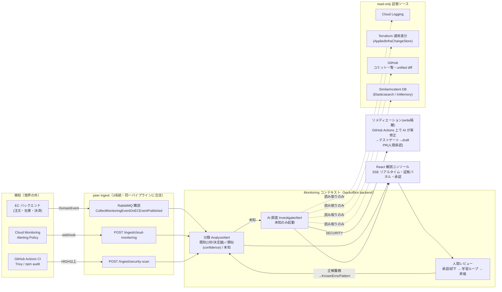
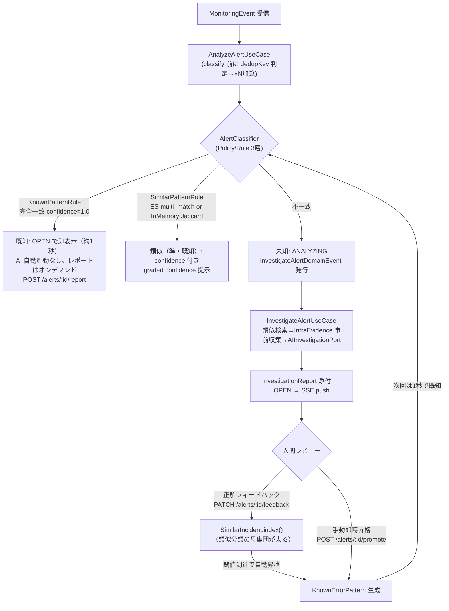
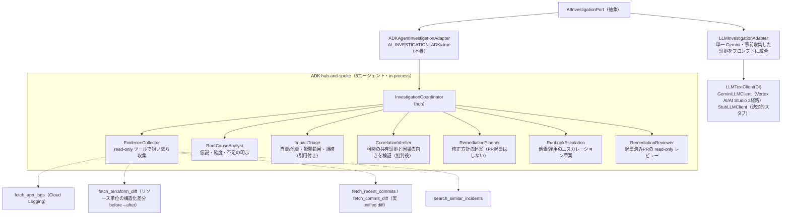
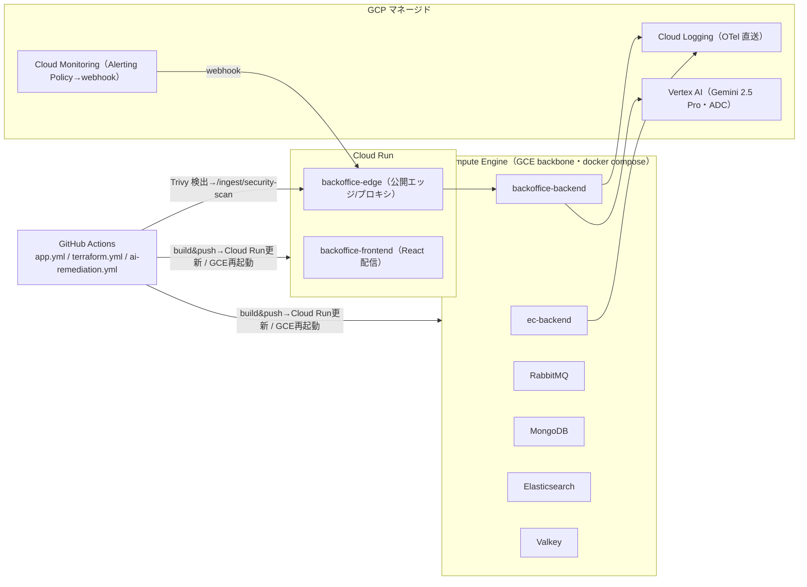
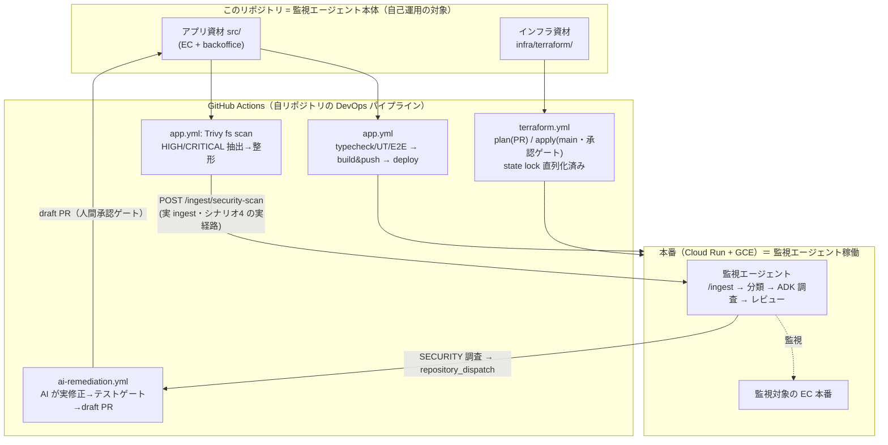

# アーキテクチャ（コード準拠・2026-07-02 時点）

> **本書はコードを正とした現状スナップショット**。設計の経緯・理由は [docs/steps/](steps/)（step 系設計書）と [docs/decisions/](decisions/) を参照。ここに書かれていることはすべて実装済み（未実装は明示）。

## 1. 一言

既存の観測基盤（Cloud Monitoring 等）の「検知」の上に乗り、アラート発火後の「**調査 → 評価 → レビュー**」の人手ワークフローを AI エージェントが圧縮するシステム。検知（閾値発火・dedup・相関）は上流の責務＝境界の外に置き、本体は「発火済みアラート」を受けて自律調査する。

## 2. システム全体図



- **検知の被り対策3層**: (a) category オーナーシップ（APPLICATION=ECイベント / INFRASTRUCTURE・CAPACITY=Cloud Monitoring が権威） (b) `dedupKey`（`source::category::eventName`＋任意 discriminator）＋ `occurrenceCount` で同型アラート嵐を1件×Nに畳む (c) 異症状・同一根本原因の相関は AI 調査に委譲（エンジン化しない）。相関（`relatedAlerts`）には**共有証拠の citation を必須化**し、収集済み証拠 id（commit sha / terraform アドレス / メトリクス名＝`collectCitableEvidenceIds`）に解決しない関連はマッパで破棄・確信度加点（`related_alert`）も citation 付きのみ＝時間が近いだけの捏造因果（例: 他責の決済タイムアウトを同時発生の在庫アラートで内部原因化）を構造的に落とす（予兆の引用検証と同型のガード）。ADK 経路ではさらに確定前に **CorrelationVerifier（批判役・推論のみ）** が「共有証拠を指せるか＋fault 分類に対し因果の向きが妥当か」を検証＝決定論の歯（citation 照合）と推論の歯（向きの検証）の二段。
- 1 ingest = 1 Alert。回復通知等は `severity=info` → `isAlertable()=false` で観測のみ。

## 3. 分類 → 調査 → 学習ループ



- 承認済みアラートは dedup 窓から除外（再発火が即・既知として新規表示＝既知事象の高速判定を体験可能）。承認済み一覧は Analytics ページで確認できる。

## 4. AI 調査の2経路（ポート DI 差し替え）



- 既知/未知でルートが変わる（既知は重い調査モジュールを通さない）。出口は自責→修正起案 / 他責→運用エスカレーションに分岐。
- 失敗時も空にしない: runner 例外・パース不能の fallback レポートに**収集済み証拠リンクを温存**。パース不能時は rawSnippet をログに残し真因を追跡。
- **fallback からの復帰導線（E3）**: fallback は行き止まりにしない。ドロワー/詳細ページの警告バナー直下に「再調査を実行」（既存 `POST /alerts/:id/reinvestigate` へ定型 operatorNote を添えてワンクリック結線・`FallbackRecoveryBanner`）、温存された証拠リンクは「収集済みの証拠リンク」として要約射影でも表示、一覧カードの「AI推定: 」空文字は「調査失敗・再調査可」の定型文に写像。
- **働きの明細（G1）**: 調査完了時に UseCase が実測メトリクス（`InvestigationMetrics`＝elapsedMs＋証拠件数内訳: ログ/メトリクス/Terraform差分/コミット/類似事例）を `InvestigationReport.metrics`（optional・後方互換）へ deterministic に添付（ADK/単一Gemini 両経路で同形・LLM 出力ではない）。UI はレポート冒頭に「**92秒**で Cloud Logging・GitHub・類似事例DB を横断し、**証拠62件**を収集して原因を推定」の実測1行（要約射影）を出し、既知一致には「既知パターン一致＝**1秒未満・AI コストゼロ**で確定」の経済性対比を添える。表示は記録済みの事実のみ（「人間なら◯分」等の換算はしない）。
- **報告書の視覚構造（E8・詳細ページ full 射影）**: 同じ実測メトリクスを**証拠フローダイアグラム**（流入源→AI 調査→結論の収束図・`EvidenceFlowDiagram`＋`evidenceFlowModel` 純関数）として図示し、G1 の実測1行は図ヘッダに吸収（同じ数字を二度出さない・描けない条件では1行へ劣化）。結論ノードに確信度ゲージ＋キャリブレーション注記を合流。冒頭は結論ファースト（AI推定パターン直下に自責/他責バッジ＋障害規模1行・推奨アクションを調査ステップより先に）。調査ステップは縦タイムライン（生エージェント名は台帳で人間語化・時刻は記録が無いため出さない＝順序のみ）。生ログ引用（算定根拠/添付証拠/判定根拠）は既定折りたたみ「n件」＋展開でソース種別レーン（観測データ/変更履歴/過去事例・`groupCitations`）。すべて記録済み実データからの表示射影＝backend 変更ゼロ（設計: `docs/steps/step6-report-visual-design.md`）。
- **調査のライブ可視化（E1）**: runner の実行イベント（agentTrace と同じタップ）を SSE 名前付きイベント `investigation-progress`（alertId/agent/tool/at）で中継。UI は ANALYZING 中に経過タイマー＋8エージェント台帳＋実行イベントのライブフィード（`InvestigationPipelinePanel`）を表示し、完了時に確定した調査ステップを順次アニメ表示する。**実イベントのみ中継**（演出の捏造なし）。Valkey 構成では専用 channel（`monitoring:sse:investigation-progress`）で fan-out。
- **着弾のライブ演出（E5）**: SSE 着弾をカード自身が prop の前回値比較で検出し、新規（createdAt が直近）はスライドイン＋グロー、既存更新はその場グロー、dedup 加算は重複カウンタのパルス、状態遷移はバッジのフェード差し替えで見せる。ヘッダのライブインジケータには最終イベント種別（「アラート受信 たった今」「AI調査 進行中」等）を添える。すべて実データ駆動・`prefers-reduced-motion` で無効化。

## 5. リメディエーション（write 隔離・人間承認ゲート）

- 調査=read / 修正=write を構造分離。自動マージは一切しない。
- 2モード（`REMEDIATION_MODE`）: **advisory**（in-process で方針テキスト→`SECURITY_REMEDIATION.md` 草案PR）／**dispatch**（`repository_dispatch` → `ai-remediation.yml` でランナー上の AI が実コード修正→Trivy 再スキャン＋テスト緑→draft PR→`POST /ingest/remediation-result` で結果確定）。
- 自己修正ループは `REMEDIATION_MAX_ATTEMPTS`（既定2）で打ち切り（課金暴走の安全弁）。対象はシナリオ4（脆弱性）のみ（5/6 は調査まで。[決定記録](decisions/decision-scenario67-remediation-dropped.md)）。

## 6. デプロイ構成



- EDA 常駐 Subscriber（RabbitMQ）はステートレスな Cloud Run と相性が悪いため GCE に置く折衷。IaC は Terraform（`infra/terraform/`・WIF で CI から plan/apply）。
- **ドッグフーディング**: このリポジトリ自身の CI（Trivy）が検出した脆弱性を本番の `/ingest/security-scan` に送る＝監視エージェント自身が同じ DevOps ループの中にいる（詳細は §6.5）。
- **観測性の現状ギャップ（設計判断・将来）**: OTel の分散トレース（`start.ts` の `TraceExporter`）はコード・SA 権限（`roles/cloudtrace.agent`）とも用意済みだが、`cloudtrace.googleapis.com` の API 有効化を意図的に見送っている（ROI 低・スパンは Cloud Trace に着かないがログ↔トレース相関フィールドは出る）。可視化が必要になったら bootstrap の services に1行足すだけ（`infra/terraform/modules/bootstrap/main.tf`）。ログ/メトリクス（Cloud Logging OTel 直送・Cloud Monitoring）は稼働中。

## 6.5 DevOps ドッグフーディング（自己運用ループ）

> 観点「実運用を見据えた DevOps プロセス」。**監視対象の EC も、監視するエージェント自身も、同じ DevOps ループの中にいる**——このプロダクトは自分自身を CI/CD で運用し、自分自身の脆弱性を自分の検知パイプラインで拾い、自分自身のコードを AI が修正して自分のリポジトリに PR を出す。デモ用の飾りではなく、`.github/workflows/` の実ワークフローがそのままプロダクトの運用系である。



- **① 自己デプロイ**（`app.yml`）: `main` push で typecheck/UT/E2E → image build&push → Cloud Run（frontend/edge）更新＋GCE backbone 再起動。エージェント本体の CD がプロダクトの CD そのもの。
- **② 自己 IaC**（`terraform.yml`）: `plan` は PR・`apply` は `main`（`environment: prod` 承認ゲート）。PR とマージの plan/apply が同一 tfstate ロックを奪い合うレースを `concurrency` で直列化済み（1回目失敗→rerun 成功の既知事象を解消）。
- **③ 自己検知（ループの閉じ）**（`app.yml` の `security-scan` job）: Trivy が**自リポジトリの依存**を fs スキャン→HIGH/CRITICAL を代表 CVE に昇格し全件同梱→本番 `/ingest/security-scan` に POST。**検知入力が外部イベントではなく自分自身の CI から来る**＝ドッグフーディングの核。これが[シナリオ4](#9-デモシナリオ7ボタンリアルさバッジ付き)の実経路。
- **④ 自己修復**（`ai-remediation.yml`）: SECURITY 調査が `repository_dispatch` を発火→ランナー上で AI が実コードを修正→Trivy 再スキャン＋テスト緑になるまで自己修正（`REMEDIATION_MAX_ATTEMPTS` で打ち切り＝課金暴走の安全弁）→**自リポジトリに draft PR**（自動マージなし・人間承認）。マージされれば ① に戻り再デプロイ＝**完全な自己参照 DevOps ループ**。

> **正直さの境界**: ①②③④は実ワークフロー。ただしデモ卓のシナリオ4は「実 CI の非同期完了を待たずに」同じ ingest 経路へ合成入力を流す（入口のみ合成・以降は実経路・UI に amber バッジ）。本物の CI 発火→PR は `main` マージ後に非同期で起き、レポートに実リンクは即時には出せない割り切り（[決定記録](decisions/)・デモ用途の設計判断）。

## 7. コード構成（DDD + Clean Architecture + CQRS + EDA）

```
src/
├── Contexts/
│   ├── EC/                       # 注文・在庫・決済（監視対象ドメイン）
│   ├── Monitoring/
│   │   ├── AlertAnalysis/        # 分類・Alert 集約・ingest 正規化（Translator）
│   │   ├── AIInvestigation/      # 調査ポート・ADK・Gateway 群・リメディ
│   │   ├── SimilarIncident/      # 類似インシデント（ES / InMemory）
│   │   └── AlertNotification/    # SSE
│   └── Shared/                   # EventBus(RabbitMQ)・CommandBus・criteria 等
└── apps/
    ├── ec/backend/
    └── backoffice/{backend,frontend}/   # frontend は features/{alerts,analytics,demo,forecast}
```

- ポート実装は `...Adapter`、ドメインサービスは `...DomainService`。driven ポートと wire DTO は infrastructure 配下。ワイヤ型は contracts に単一ソース化。
- テスト: Vitest（BDD）unit 846件（backend 600・frontend〔jsdom/RTL 別プロジェクト〕246）。docker 必須の結合（`*.int.test.ts`）は `make test-integration` の別ラン。分岐の厚い ACL は fake 注入の UT、薄いリポジトリは E2E（Playwright は `e2e/`）。

## 8. 主要 API（backoffice）

| エンドポイント                    | 役割                                                                                                                                                     |
| --------------------------------- | -------------------------------------------------------------------------------------------------------------------------------------------------------- |
| `GET /alerts` / `GET /alerts/:id` | 一覧・詳細（一覧は SSE `GET /stream` でライブ更新。名前付きイベント: `remediation`＝リメディ確定、`investigation-progress`＝ADK 調査の実行イベント中継） |
| `PATCH /alerts/:id/feedback`      | 正解/不正解フィードバック（正解→SimilarIncident 蓄積→閾値で自動昇格）                                                                                    |
| `POST /alerts/:id/promote`        | 手動即時昇格（結晶化）                                                                                                                                   |
| `POST /alerts/:id/report`         | 既知/類似へのオンデマンド AI レポート生成（202→SSE）                                                                                                     |
| `POST /alerts/:id/reinvestigate`  | オペレーターノート付き再調査                                                                                                                             |
| `POST /ingest/cloud-monitoring`   | Cloud Monitoring webhook（Basic 認証）                                                                                                                   |
| `POST /ingest/security-scan`      | CI/Trivy 検知（`INGEST_TOKEN`）                                                                                                                          |
| `POST /ingest/remediation-result` | AI リメディ CI の結果 callback                                                                                                                           |
| `GET /analytics`                  | 承認済みアラート等の集計ビュー                                                                                                                           |
| `POST /demo/scenario` ほか        | デモ操作卓（`DEMO_ENABLED` 配下）                                                                                                                        |
| `GET /forecast`                   | 予兆ブリーフィング＝事前生成済みの最新リスク予報（`FORECAST_ENABLED` 配下・Gemini 非呼び出し＝無人閲覧に課金ゼロで耐える）                               |
| `POST /forecast`                  | 予報の生成（`FORECAST_ENABLED` かつ `DEMO_ENABLED` 配下・Gemini 呼び出し・horizon は `FORECAST_HORIZON` 固定）                                           |

## 9. デモシナリオ（7ボタン・リアルさバッジ付き）

> 旧「在庫競合（未知）」は廃止（実コードに楽観ロック＋指数バックオフのリトライが実装済みで、AI 生成の「楽観ロックを導入せよ」推奨と矛盾するため。詳細は [step6 §J](steps/step6-final-sprint-todo.md)）。以降を -1 繰り上げ済み。

| #   | シナリオ                             | 分類スペクトル               | 入力のリアルさ                                                 |
| --- | ------------------------------------ | ---------------------------- | -------------------------------------------------------------- |
| 1   | 決済タイムアウト                     | 完全一致（既知・1秒）        | 実トリガ（実注文投入）                                         |
| 2   | DBコネクションプール枯渇             | 類似（準・既知・confidence） | 実トリガ                                                       |
| 3   | インフラ障害                         | 未知                         | クラウド実検知（Cloud Monitoring 経由・GCP環境のみ）           |
| 3b  | インフラ障害（反復用）               | 未知                         | 合成入力（入口のみ合成・パイプラインは実経路）                 |
| 4   | 脆弱性検知 → 修正 draft PR           | SECURITY                     | 合成入力（実 CI と同一経路）                                   |
| 5   | 構成変更障害（terraform apply 起因） | 未知                         | 合成入力（構造化差分は実機構）                                 |
| 6   | アプリコード退行                     | 未知                         | 合成入力（**コミット・diff・修正PRは実物**・demo隔離ブランチ） |

**正直さの原則**: 合成入力は UI に amber バッジで明示。エンドポイントの無い偽ボタンは作らない。

## 10. 未実装（設計のみ）

- **予兆ブリーフィング（Forecast）**: 未来シグナル×記憶の引用付きリスク予報。設計確定・実装は [docs/steps/step6-final-sprint-todo.md](steps/step6-final-sprint-todo.md) F1〜F8・F10〜F12 で進行。着地済み: F1 ドメイン型（`Monitoring/Forecast/domain/`：`ForecastSignal`/`RiskForecast`/`Schedule`/`ScheduleSource`/`ForecastSignalSource`）、F2 ForecastMemory projection（突合キー(B)：`ForecastMemory`/`forecastSubject` 導出・照合規約/`ResolvedAlertForecastMemoryRepository`。`InvestigationReport` に optional `subject` を追記し調査時に deterministic 導出＝唯一の既存P0変更点）、F3 未来シグナル（`GitHubGateway.listOpenPullRequests`/`TerraformGateway.getPendingPlan`＋`PendingInfraPlanStore`、Source 3実装 `PullRequestSignalSource`/`PendingPlanSignalSource`/`ScheduleSignalSource`＝正規化を Source 内に閉じ Handler は配列を回すだけ・全て read-only・失敗時は源単位で空縮退）、F4 ForecastPort＋Gemini アダプタ（`ForecastPort`/`ForecastContext`＋`GeminiForecastAdapter`。**単発 Gemini 経路・ADK 非使用は意図的**＝入力は Handler が事前収集済みでツールコール型探索が不要、`responseMimeType=application/json` 強制で無人閲覧の構造化堅牢性を優先。`LLMTextClient`（GeminiLLMClient）注入のコンポジション・JSON固定＋citations必須プロンプト・safeParse・confidenceクランプ・未知levelはLOW丸め・level降順ソート・失敗時は throw せず `isFallback=true` 縮退。citations 空/偽引用を落とすのは F5 引用検証の責務）、F5 ForecastRiskCommandHandler（`Forecast/application/ForecastRisk/`。Source 配列を回して主シグナル収集→subject で ForecastMemory を引き MEMORY シグナルへ正規化→結合→Port.forecast→**引用検証＝citations を実在シグナル id に照合し偽引用は破棄・裏付けゼロのリスクは丸ごと破棄**（`forecast_fake_citation_dropped`/`forecast_uncited_risk_dropped` ログ）→`RiskForecastRepository` に最新1件保存。シグナル0件は Gemini 非呼び出しで空予報＝課金ゼロ。予報はシグナル全量同梱の `ForecastBriefing` として保存＝引用チップの解決先を配信に含める。wire 契約は `Forecast/domain/contracts/ForecastContract.ts`）、F6 ルート・DI（`GET /forecast`=事前生成済みキャッシュ配信・`POST /forecast`=生成（`DEMO_ENABLED` 配下）。`forecastGuard` が `FORECAST_ENABLED` off（既定）で 404。`BackofficeApp` が `ForecastSignalSource[]` を組み立て（★Gateway 名指しなし・`InMemoryPendingInfraPlanStore` を `TerraformGatewayImpl` に配線）、`SeedScheduleSource`（seed は `seeds/ForecastScheduleSeed.ts`・`DEMO_ENABLED` 配下で投入）、`ForecastMemoryRepository.warmUp()` は `FORECAST_ENABLED` 時のみ起動時実行。`FORECAST_HORIZON` 既定 "今週末"）、F7 UI（`frontend/features/forecast`＝domain（`ForecastView`/`RiskLevel` 純関数・wire は `ForecastContract` を `@monitoring` alias 直 import）/infrastructure（`forecastApi`＝GET の 404 を body で「機能off（guard・非JSON）/未生成（JSON）」に判別し可用性を返す＝専用 status API を増やさない）/application（`triggerForecast`）/presentation（`ForecastProvider`＝GET 1回でナビ表示可否＋最新予報を全ページ共有・`ForecastPage`＝リスク level 降順・`RiskCard`＝levelバッジ+confidenceゲージ+reasoning・**`CitationList`＝引用検証済みシグナルのみの引用チップ（PR/スケジュール/過去アラートへ実リンク・ハルシネーション否定の可視化）**）。`/forecast` SPA ルート追加（vite proxy / nginx を Accept 出し分けの SPA-aware 側へ移動）・Forecast ナビタブは `FORECAST_ENABLED` off で非表示＋HIGH n件バッジの導線1個。カード描画は `shared/ui/ReferencedEvidenceCard` へ昇格し相関パネル（`RelatedAlertsPanel`）と共有＝「参照 id を実在レコードへ解決して提示する」同型パターンの単一実装）、F8 フラッグシップ seed（§3.1 DB接続枯渇の3系統: `seeds/ForecastPendingPlanSeed.ts`＝Cloud SQL `max_connections` 100→40 の未適用 plan（`DEMO_ENABLED` 配下で `InMemoryPendingInfraPlanStore` へ投入）／`seeds/ForecastScheduleSeed.ts`＝土20:00 checkout 負荷x5／`seeds/ResolvedAlertSeed.ts` に過去解決事例2件追加（`FORECAST_MEMORY_SEED_ALERT_IDS`・`report.subject` を plan の terraform address / schedule の checkout とトークン突合する語彙で明示＝MEMORY 引用が `incident.<実在AlertId>` として `GET /alerts/:id` に解決できる）。**MEMORY は生成時に再 warmUp**（`ForecastRiskUseCase.recallMemorySignals`）＝demo reset の再seed・直前に承認/解決した事例が backend 再起動なしで記憶に載る。ローカルE2E（`e2e/backoffice/forecast.e2e.test.ts`・`AI_INVESTIGATION_STUB=true`）は `StubLLMClient` が予兆 SYSTEM_INSTRUCTION を判別して固定予報（**意図的な偽引用 ghost-\* 入り**・実在引用は plan-1/sch-1/inc-1 の3系統）を返し、引用検証＝偽引用 drop・裏付けゼロ破棄・MEMORY の実在解決・GET キャッシュ配信を課金なしで決定論検証する。UI は RiskCard が **window（いつ危ないか）を主見出し**にし、引用を種別レーン（変更予定 cyan／負荷予定 amber／過去の記憶 emerald）＋「根拠 n系統」チップで**系統の収束**として見せる（`groupCitationsByKind`・タイムチャートは window が LLM 由来の自由文字列のため不採用）。MEMORY 引用の「当時のアラートを開く」は、一覧 API が RESOLVED を除外するため詳細ページ側で `GET /alerts/:id` へフォールバックして解決する（`useAlertDetail` が現役＝共有一覧 state・アーカイブ＝単品 fetch の二源を単一インターフェースに畳む。アーカイブは共有一覧 state へ merge しない＝一覧に混入しない。類似分類の関連アラート導線も同経路））、F10/F11 予防ファースト（予兆の主目的＝**発火前にインシデントを握りつぶす**。F11a 先手: `RiskItemPrimitives.preventiveAction?`（optional・後方互換）を LLM に「citations の実在シグナルに言及する具体的な先手・**「〜することを推奨します」形・HIGH/MEDIUM は原則必須**・実行主体は人間・reasoning は診断に徹し対処を書かない」で生成させ、safeParse で trim・不正はフィールドごと drop＝出なくても先手行が消えるだけの縮退。`RiskCard` は reasoning 直下に cyan パネル「🛡 今打てる先手」を**カード内の主役**として表示し、実行先（PR/plan/過去 Alert）への動線は CitationList の実リンクが担う＝「先手を読む→引用から実行先へ飛ぶ→人間が外で防ぐ」の1クリック動線が write ゼロで閉じる。F10-②/F11b 橋渡しCTA: `ForecastBridgeCta`＝発火後の受け皿（/alerts の反応的パイプライン）への**純ナビゲーション**を「もし防ぎきれずに発火したら？」の**保険トーン**で先手ブロックに視覚従属させ、risks がある時だけ `BriefingBody` 末尾にページ単位で1個・破線ボーダー＝未発火の未来を実線 RiskCard と視覚区別・テキストリンクのみで button 不在＝**write-zero を UI 語彙でも維持**。mutate 系アクション・トリアージ状態は不採用＝予兆の防御アクションはシステム外の人間判断という設計思想）、F12 予兆デモコンソール（`DELETE /forecast`＝`RiskForecastRepository.clearLatest()`・`demoGuard` 配下。**アラート側 /demo/reset とは独立**＝一覧のリセットが提出前に温めた予報キャッシュ（無人閲覧の要）を巻き込まない。UI は `ForecastDemoConsole`＝アラート一覧の DEMO CONSOLE と同一視覚言語（fuchsia ピル・realness バッジ・cyan 実行/rose リセット）の右 aside パネルで、**投入シグナル台帳**（実データ＝実 GitHub PR は1つだけ・残りは合成 seed、と本物度を明示）＋「▶ 予報を生成（AI 突合・約1分）」「予報をリセット」を集約。可用性は GET /demo/status 404 判定＝本番ではコンソールごと非表示・予報閲覧は無傷）。**残タスクは F8 の実PRステージング（pool 100→40 の draft PR）と録画のみ**。
- **イベントソーシング基盤（stretchⅢ）**: ハッカソン後。[docs/steps/step4-1-strategy.md](steps/step4-1-strategy.md) §7.10。
- `VertexLLMClient`（独立クラスとしては未実装。Vertex AI 経路は `GeminiLLMClient` の `GOOGLE_GENAI_USE_VERTEXAI=true` で実現済み）。
