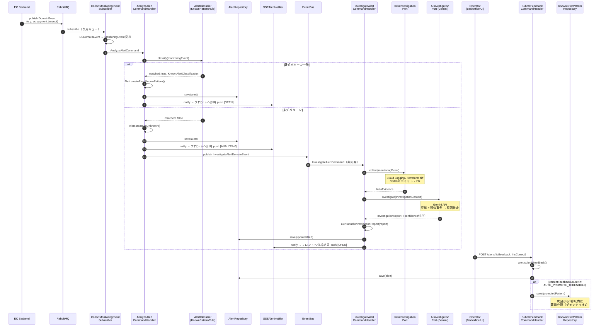

# Step 4-1: 戦略設計（なぜ作るか・差別化・スコープ・優先度）

> **Step4 を4分割したうちの「戦略設計」担当。最初に読む。**
> 技術詳細は下記を参照。本書は「何を・なぜ・どの順で・どこまで」を決める。
>
> | 順  | スコープ            | 設計ドキュメント                      | TODO                                       |
> | --- | ------------------- | ------------------------------------- | ------------------------------------------ |
> | 1   | 戦略設計            | `docs/step4-1-strategy.md`（本書）    | `docs/step4-1-strategy-todo.md`            |
> | 2   | context/Monitoring  | `docs/step4-2-monitoring-context.md`  | `docs/step4-2-monitoring-context-todo.md`  |
> | 3   | backoffice/backend  | `docs/step4-3-backoffice-backend.md`  | `docs/step4-3-backoffice-backend-todo.md`  |
> | 4   | backoffice/frontend | `docs/step4-4-backoffice-frontend.md` | `docs/step4-4-backoffice-frontend-todo.md` |

---

## 1. プロダクトの一言

**既存の観測SaaS（Datadog等）の "検知" の上に乗り、アラート発火後の「調査 → 評価 → レビュー」という人手のワークフローを圧縮するAI調査エージェント。**

分類ツールではなく、複数ソース（Cloud Logging / Terraform差分 / GitHub）を**自律的に横断して証拠を積み上げ、根拠付きで原因を推定し、人間がレビュー・承認する**——この一連を1ループで体現する。

---

## 2. 差別化（なぜSaaSと競合しないか）

| レイヤー              | 既存SaaS（Datadog/NewRelic/Splunk）          | 本プロダクト                                       |
| --------------------- | -------------------------------------------- | -------------------------------------------------- |
| 検知（detection）     | **支配領域**。メトリクス・ログ集約・異常検知 | やらない（彼らの上に乗る）                         |
| 調査（investigation） | 一部AI補助（Watchdog/Bits AI）               | **主戦場**。複数ソース横断の証拠収集を自律化       |
| 評価（evaluation）    | 手作業                                       | 類似インシデント照合＋AI原因推定（confidence付き） |
| レビュー（review）    | 手作業（ポストモーテム）                     | reviewStatus（承認/却下）＋修正PR起票まで          |

**Elasticのシナジー**: 運用履歴へのRAG。証拠が太る（logs + terraform diff + git）ほど類似検索の精度が上がり、ハルシネーションでなく**引用付きの仮説**が出る。

**設計の肝**: 「証拠収集（read-only）→ 事例照合（Elastic）→ AI推定（Gemini/ADK）→ 人間レビュー（＋修正PR）」の多層パイプライン。各層は別レイヤーでトレードオフでなくシナジー。

---

## 3. ハッカソン審査基準への対応

| 審査基準                              | 本プロダクトの当て方                                                                                      |
| ------------------------------------- | --------------------------------------------------------------------------------------------------------- |
| 1. AIエージェントが価値の中心／自律性 | **自律的な証拠追加収集ループ**（analystが次に取る証拠を自分で判断）＋ADKマルチエージェント。"必然性" の核 |
| 2. 課題へのアプローチ・ストーリー     | AI-SRE（調査→レビュー圧縮）。旬で一貫性のある物語                                                         |
| 3. ユーザビリティ                     | バックオフィスで「証拠が積み上がる過程」を可視化。承認ボタン1つ                                           |
| 4. 実用性・体験価値                   | MTTR短縮の実感。CI連携でPR起票まで自動                                                                    |
| 5. 実装力                             | DDD/Clean/CQRS/EDA＋ポート段階移行。GCP（Gemini/ADK/Cloud Run）＋Elastic活用                              |

> 「つくる（調査エージェント）・まわす（GitHub Actions/CI）・とどける（Cloud Runデプロイ）」を**シナリオ5で1ループに**収める。

---

## 4. 重要な技術方針の決定

### a2a は使わない

- マルチエージェント分割（並列専門調査・自律ループ）は **ADKのin-processサブエージェントで実現でき、a2aは不要**。
- a2aは「異ベンダー/別ランタイム相互運用」専用（例: Elastic Agent Builder ↔ Gemini Enterprise）。本構成では境界をまたがないので使わない。
- 「トークン最適化」は*分割*の効果であってa2aの効果ではない。

### マルチエージェントは ADK in-process

- `AIInvestigationPort` の裏に Coordinator + 専門agent（Evidence/RootCause/Remediation）を1プロセスで構成。詳細は `step4-2`。
- フェーズ0（単一Gemini）で提出可能状態を確保 → ポート差し替えでADK版を載せる。

### category 弁別子

- `MonitoringEvent.category`（APPLICATION/INFRASTRUCTURE/CAPACITY/SECURITY）をサブクラスでなく弁別子フィールドで持つ。
- 「どの調査担当に振るか」のディスパッチキー。a2aの有無に依存しない前方互換。

### 調査(read) と リメディエーション(write) の分離

- 調査Gateway（CloudLogging/Terraform/GitHub）は読み取り専用。
- write操作はPR起票のみで `RemediationPort` に隔離。自動マージしない。
- 「AIが調査・人間が承認」を構造で体現。

### デプロイ：Cloud Run（見せ場）＋ Compute Engine

- 「とどける」の見せ場は Cloud Run に載せる。
- EDA（RabbitMQ常駐Subscriber）はステートレスなCloud Runと相性が悪い → 全部は載せない。**少なくともbackoffice（or 調査API）をCloud Run実機**にして物語を取る。トレードオフはADR化。

---

## 5. インシデントのスコープと優先度（7/10締切）

> 種類を増やして見せる発想は捨てる。**深さ優先**。a2a/Elastic/カテゴリの価値はインシデント種別と直交するので、新カテゴリをむやみに増やさない。

| 優先             | インシデント                  | category       | 根拠                                                                     |
| ---------------- | ----------------------------- | -------------- | ------------------------------------------------------------------------ |
| **必須（確定）** | Payment Timeout               | APPLICATION    | **コードに実在するDomainEvent**。追加工数ゼロ                            |
| **必須（確定）** | Inventory Reservation Failed  | APPLICATION    | 同上。EDA→Monitoring→AI調査→SSEのE2Eを最小コストで通す                   |
| **差別化の本丸** | IaC/設定変更起因（シナリオ4） | INFRASTRUCTURE | Cloud Logging+Terraform+GitHubの横断証拠収集を駆動できる唯一の種別       |
| **DevOps半分**   | CI/Trivy 脆弱性（シナリオ5）  | SECURITY       | CI/CDを装飾でなく機能させる。PR起票＝自律write。ソロでもDevOps物語が立つ |
| ストレッチ       | Traffic Spike                 | CAPACITY       | 新イベントソースの配管が要る。Phase0+1が早く終わった時だけ               |
| やらない         | DB / K8s 障害                 | -              | 再現コスト高、デモ価値に対し割が合わない                                 |

---

## 6. スコープ単位の進め方（スケジュールでなくスコープで一気に）

フェーズ（時間軸）でなく**スコープ単位**で一気にやる方針。各スコープのTODO内でタスクを依存順に並べ、各タスクに優先度タグ（**P0必須** / **P1差別化** / **stretch**）を付ける。

```
進める順番（ファイル番号順）:
  1. step4-1-strategy        ← 本書。前提セットアップ・意思決定（step4-1-strategy-todo）
  2. step4-2-monitoring-context ← Monitoringコンテキスト本体（最重要・最大）
  3. step4-3-backoffice-backend ← Express配線・SSE・ingest
  4. step4-4-backoffice-frontend ← UI（証拠パネル・承認・SSE）
```

> 各スコープ内で「P0だけ先に全部 → P1 → stretch」と進めれば、途中で止まっても**常に提出可能な状態**を保てる。

---

## 7. 予兆ブリーフィング（stretchⅡ・reactive → proactive）

> **位置づけ**: P0 ＋ P1 ＋ 既存stretch（ADK in-process）が**全部着地した後**にのみ着手する capstone。設計は本書で今固め、実装は最後。間に合わなければ設計書とADRで語る。

### 7.1 何をする機能か

既存はすべて**反応的**（インシデントが因果的に発生してから調査・評価・レビュー）。予兆ブリーフィングは**予防的**——「**既に分かっている未来シグナル**（未マージPR・未適用Terraform plan・業務/負荷スケジュール）」と「**蓄積した記憶**（SimilarIncident / KnownErrorPattern）」をエージェントが突き合わせ、**根拠（引用）付きのリスク予報**を出す。

```
[未来シグナル]                          [記憶＝既存資産]
 ├ GitHub open PR（未マージ）             ├ SimilarIncident（過去事例）
 ├ Terraform pending plan（未適用）        └ KnownErrorPattern
 └ Schedule（週末セール→負荷x5）                ↓ エージェントが突合・推論
   → 「土20:00、DB接続枯渇 HIGH（confidence 0.78）
       根拠: PR#123のpool縮小 × 過去同型3件 × セール負荷」
```

### 7.2 なぜ差別化として強いか（既存への上乗せ価値）

- **既存投資の伏線回収**: P1（InfraEvidence Gateway群）と P0（SimilarIncident記憶）を**再利用**するだけで成立。先行投資が「目的的」に見える構造。
- **差別化軸が直交**: 既存stretch（ADK）は「どれだけ高度に作ったか」、予兆は「どんな独自価値か」。審査基準（自律性・必然性・体験）への効きは **予兆 > ADK**。
- **統計MLでない**: フォージャストはレッドオーシャン＆データ大量要。本機能は **LLMによる"既知シグナルの突合推論"** なのでデモ規模でも成立する（→ ADR）。
- **設計だけでも効く**: 「P0パイプラインを一切触らず、read-only Gateway＋記憶の再利用で予報能力を**追加的に**載せられる」＝アーキテクチャ拡張性の証明。

### 7.3 統合の難所は"自前で解かない"（3点の足場＋LLM委譲）

突合（join）はルールエンジンで解くとブリットルで終わらない。**joinはGeminiに委譲**し、人間側は3点だけ用意する：

1. **正規化**: 全シグナルを共通の突合軸 `subject`（対象コンポーネント）＋ `when`（時間窓）＋ `desc` に揃える（`ForecastSignal`）。
2. **引用縛り**: 出力JSONで各リスクに「使ったシグナルidの `citations`」を**必須**にする（空は不正）。
3. **引用検証**: Handler側で `citations` のidが収集済みシグナルに**実在するか照合**し、実在しない引用のリスクは落とす/フラグ（ハルシネーション・ガード、数十行）。

→ what/when/how の推論はモデルがやる。人間は「joinできる形に整える・引用を強制する・引用の実在を検証する」だけ。

### 7.4 段階設計（A→B移行の物語をそのまま採用）

突合キーをどこまで構造化するかが唯一の判断点。**本プロジェクトは (B) を採る**（将来移行込み・時間があれば実装）。

| 段階            | 突合方式                                                                                        | 既存データ構造への影響                                                                  | 精度                 |
| --------------- | ----------------------------------------------------------------------------------------------- | --------------------------------------------------------------------------------------- | -------------------- |
| (A)             | 既存 `InvestigationReport`/`InfraEvidence` を**テキストのまま**contextに流しLLMに意味joinさせる | 変更ゼロ                                                                                | ブレやすい           |
| **(B)（採用）** | 過去インシデントに **`subject`/`component` 構造化タグ**を持たせて突合                           | `InvestigationReport` に optional `subject` 追記 **or** `ForecastMemory` projection新設 | 安定・引用検証が効く |

> 「最初テキストjoin(A)で動かし、精度のために部品タグ(B)を構造化した」という**進化自体がADRになる**。

### 7.5 データ構造への影響範囲（既存P0は無傷）

| 階層             | 内容                                                                                          | 既存step4項目                  |
| ---------------- | --------------------------------------------------------------------------------------------- | ------------------------------ |
| ① 完全新規型     | `RiskForecast`（集約/read-model）/ `ForecastSignal` / `Schedule`・`ScheduleSource`            | 追加のみ（既存無傷）           |
| ② 既存への追記   | `GitHubGateway.listOpenPullRequests()` / `TerraformGateway.getPendingPlan()`（read-only維持） | メソッド追加                   |
| ③ 記憶の突合キー | (B採用)`InvestigationReport` に optional `subject` **or** `ForecastMemory` projection         | optional追記 or 新規projection |

> **ランタイムの反応的パイプライン（AnalyzeAlert/InvestigateAlert）は無傷**。予兆は新規 `ForecastRiskCommandHandler` として横に生やす（write無し＝read-onlyの調査の一種）。

### 7.6 デモ方針（録画前提）

- ハッカソンはデモ動画提出が通る。**ライブ安定動作のコストは不要**。「実際に動いた1回を録る」（捏造はNG）。
- seed: 過去インシデント2〜3件＋ステージした未マージPR＋スケジュール。`/forecast` 起動でライブ生成 → 引用付きリスクをデモシナリオ6として収録。

### 7.7 見積もり（P1完了を前提とした増分・(B)採用）

| 工程                                                                         | 工数           |
| ---------------------------------------------------------------------------- | -------------- |
| シグナル正規化（既存Gateway結果に subject/when ラベル付け＋②のメソッド追加） | 1d             |
| ForecastMemory projection＋ `subject` タグ付け（③・B採用分）                 | 0.5〜1d        |
| Forecast context builder＋引用縛りプロンプト＋JSONスキーマ＋**引用検証**     | 1d             |
| API（POST/GET /forecast）＋最小表示（既存UI相乗り可）                        | 0.5d           |
| seed＋いい1テイク録る                                                        | 0.5d           |
| **合計（B採用・録画前提）**                                                  | **≈ 3.5〜4日** |

### 7.8 ADR種（Step5）

- 予測を統計MLでなく **LLM推論＋引用検証** で構成する理由（データ依存を切る判断・デモ規模での成立）
- joinを自前ルールエンジンでなく **LLMに委譲し、人間は正規化／引用縛り／引用検証の3点足場に限定**する理由
- 突合キーを **(A)テキストjoin → (B)構造化タグ** へ段階移行する理由（精度と既存無傷のトレードオフ）
- 予兆能力を **P0パイプライン無傷の追加レイヤー**（read-onlyの調査の一種）として載せる設計判断

---

## 8. フロー全体図（発表資料用）

> **位置づけ**: ハッカソン発表・説明資料用のシーケンスと工程表。  
> ランタイムの全フローを「イベント受信 → 分類 → 診断 → フィードバック昇格」の1ループで示す。

---

### 8.1 シーケンス図



---

### 8.2 工程表（ステップ別）

| #   | ステップ                 | 担当コンポーネント                               | 入力                                     | 出力                                                           | 主要技術                                       |
| --- | ------------------------ | ------------------------------------------------ | ---------------------------------------- | -------------------------------------------------------------- | ---------------------------------------------- |
| 1   | **イベント受信・変換**   | `CollectMonitoringEventSubscriber`               | EC DomainEvent（RabbitMQ）               | `MonitoringEvent`                                              | RabbitMQ / amqplib                             |
| 2   | **分類**                 | `AnalyzeAlertCommandHandler` + `AlertClassifier` | `MonitoringEvent`                        | `AlertClassificationResult`                                    | `KnownPatternRule`（InMemory完全一致）         |
| 3a  | **既知Alert生成・通知**  | `AnalyzeAlertCommandHandler`                     | `KnownAlertClassification`               | Alert（`OPEN`）+ SSE push                                      | MongoDB + Node.js EventEmitter                 |
| 3b  | **未知Alert生成・通知**  | `AnalyzeAlertCommandHandler`                     | -                                        | Alert（`ANALYZING`）+ SSE push + `InvestigateAlertDomainEvent` | MongoDB + SSE + EventBus                       |
| 4   | **インフラ証拠収集**     | `InfraInvestigationPort`                         | `MonitoringEvent`                        | `InfraEvidence`                                                | Cloud Logging API / Terraform CLI / GitHub API |
| 5   | **AI調査**               | `AIInvestigationPort`（Gemini Adapter）          | `InvestigationContext`（証拠＋類似事例） | `InvestigationReport`（confidence付き）                        | Gemini API（gemini-2.0-flash）                 |
| 6   | **Alert更新・通知**      | `InvestigateAlertCommandHandler`                 | `InvestigationReport`                    | Alert（`OPEN`）+ SSE push                                      | MongoDB + SSE                                  |
| 7   | **オペレーターレビュー** | `SubmitFeedbackCommandHandler`                   | `isCorrect`フラグ + note                 | Alert更新（`reviewStatus` = APPROVED/REJECTED）                | MongoDB                                        |
| 8   | **パターン自動昇格**     | `SubmitFeedbackCommandHandler`                   | `correctFeedbackCount >= N`              | `KnownErrorPattern` 新規登録                                   | MongoDB                                        |

---

### 8.3 コンテキスト構造（論理型による整理：Bateson）

> **論理型（Bateson / Russell）で整理する。** ベイトソンの「フレーム」は額縁の比喩で、**ある前提・言語が通用する境界を画定し、その機能は「論理型を画定する（delimit a logical type）」こと**（_A Theory of Play and Fantasy_, 1955）。DDD の bounded context は「あるユビキタス言語が通用する境界」なので、**bounded context ＝ ベイトソンのフレーム**として読める。
>
> ベイトソンの「**context of context ＝ メタコンテキスト**」（より高い論理型）に従い、`Monitoring` は**メタコンテキスト**、その**メンバが各コンテキスト**（AlertAnalysis / AIInvestigation / ReportGeneration）。クラスとメンバは異なる論理型なので「サブコンテキスト」とは呼ばない（メタの一段下のメンバであって、二段下の入れ子ではない）。

**メタコンテキストが画定するフレーム＝「観測（observation）」**。EC専用ではない。EC ドメインイベント・CI の Trivy 脆弱性通知・インフラシグナルなど**異種の源**を、源固有の型を剥いで均質な観測に正規化する境界がフレームで、`category`（APPLICATION/INFRASTRUCTURE/SECURITY/CAPACITY）がその「EC専用でない」ことの証拠。

```
Monitoring（メタコンテキスト ＝ 観測フレームを画定する高位の論理型）
│
│  ［境界の変換点］各源固有の型に触れるのはここだけ
│   ├─ CollectMonitoringEventSubscriber（EC DomainEvent → MonitoringEvent）
│   └─（将来）CI/infra ingest アダプタ（Trivy / インフラシグナル → MonitoringEvent）
│
├─ Shared/domain/MonitoringEvent  ← フレーム内で通用するユビキタス言語（共有カーネル）
│    ※ フレームそのものではなく、フレームの内側で話される共通語
│
├─ AlertAnalysis（コンテキスト）
│    「MonitoringEvent は既知パターンか」を分類する
│    集約: Alert / KnownErrorPattern
│
├─ AIInvestigation（コンテキスト）
│    「未知の MonitoringEvent の原因は何か」を調査する
│    InfraEvidence 収集 → Gemini推論 → InvestigationReport
│
└─ ReportGeneration（コンテキスト）
     「Alert の状態変化をフロントに届ける」
     SSEAlertNotifier
```

| 論理型                             | 担当                                       | 画定するフレーム / 通用する前提                                              |
| ---------------------------------- | ------------------------------------------ | ---------------------------------------------------------------------------- |
| **メタコンテキスト**（Monitoring） | 異種の源を均質な観測へ正規化する境界を画定 | 「ここから内側はすべて均質な観測として扱う」。源固有の型はメンバに漏らさない |
| コンテキスト（AlertAnalysis）      | 既知パターンと照合する                     | `MonitoringEvent`・`KnownErrorPattern`                                       |
| コンテキスト（AIInvestigation）    | 証拠を集めてAIに渡す                       | `MonitoringEvent`・`InfraEvidence`・Gemini                                   |
| コンテキスト（ReportGeneration）   | フロントへ配信する                         | SSE / Alert のプリミティブ                                                   |

> 各コンテキストは `MonitoringEvent` という共通語だけで仕事し、源固有の型（EC / CI / infra）を直接 import しない。  
> これが「メタコンテキストが観測フレームを画定し、メンバのコンテキストはそのフレームの内側で閉じる」という論理型構造の実体。

> **参考（一次ソース）**:
>
> - G. Bateson, _A Theory of Play and Fantasy_ (1955) — 心理的フレーム（inclusive/exclusive・メタコミュニケーション・論理型の画定）
> - G. Bateson, _The Logical Categories of Learning and Communication_ — context / context of context（メタメッセージの階層＝論理型）

---
